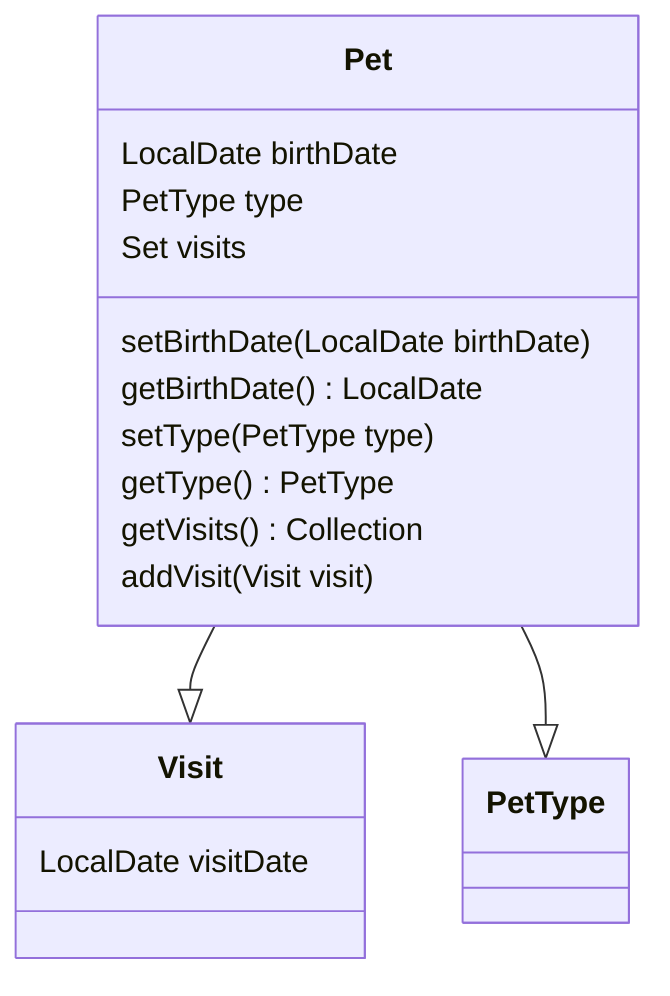

# Overview

The <SwmToken path="src/main/java/org/springframework/samples/petclinic/owner/Pet.java" pos="45:4:4" line-data="public class Pet extends NamedEntity {">`Pet`</SwmToken> class is a business object representing an animal that belongs to an owner. Each <SwmToken path="src/main/java/org/springframework/samples/petclinic/owner/Pet.java" pos="45:4:4" line-data="public class Pet extends NamedEntity {">`Pet`</SwmToken> has attributes such as birth date and type, which are used to store specific details about the pet. Pets are associated with visits, which record the medical history and check-ups of the pet. In the owner management system, pets are linked to their respective owners, allowing for easy management and retrieval of pet information.

<SwmSnippet path="/src/main/java/org/springframework/samples/petclinic/owner/Pet.java" line="45">

---

# Pet Class

The <SwmToken path="src/main/java/org/springframework/samples/petclinic/owner/Pet.java" pos="45:4:4" line-data="public class Pet extends NamedEntity {">`Pet`</SwmToken> class defines the attributes and methods for managing pet information, including birth date, type, and visits. The class extends <SwmToken path="src/main/java/org/springframework/samples/petclinic/owner/Pet.java" pos="45:8:8" line-data="public class Pet extends NamedEntity {">`NamedEntity`</SwmToken> and includes methods to set and get the pet's birth date, type, and visits, facilitating the manipulation and access of pet data.

```java
public class Pet extends NamedEntity {

	@Column(name = "birth_date")
	@DateTimeFormat(pattern = "yyyy-MM-dd")
	private LocalDate birthDate;

	@ManyToOne
	@JoinColumn(name = "type_id")
	private PetType type;

	@OneToMany(cascade = CascadeType.ALL, fetch = FetchType.EAGER)
	@JoinColumn(name = "pet_id")
	@OrderBy("visit_date ASC")
	private Set<Visit> visits = new LinkedHashSet<>();

	public void setBirthDate(LocalDate birthDate) {
		this.birthDate = birthDate;
	}

	public LocalDate getBirthDate() {
		return this.birthDate;
```

---

</SwmSnippet>

# Pet Attributes

The <SwmToken path="src/main/java/org/springframework/samples/petclinic/owner/Pet.java" pos="45:4:4" line-data="public class Pet extends NamedEntity {">`Pet`</SwmToken> class includes several attributes that store specific details about the pet.

<SwmSnippet path="/src/main/java/org/springframework/samples/petclinic/owner/Pet.java" line="47">

---

The <SwmToken path="src/main/java/org/springframework/samples/petclinic/owner/Pet.java" pos="49:5:5" line-data="	private LocalDate birthDate;">`birthDate`</SwmToken> attribute is used to store the pet's birth date. It is annotated with <SwmToken path="src/main/java/org/springframework/samples/petclinic/owner/Pet.java" pos="47:1:2" line-data="	@Column(name = &quot;birth_date&quot;)">`@Column`</SwmToken> and <SwmToken path="src/main/java/org/springframework/samples/petclinic/owner/Pet.java" pos="48:1:2" line-data="	@DateTimeFormat(pattern = &quot;yyyy-MM-dd&quot;)">`@DateTimeFormat`</SwmToken> to specify the database column name and the date format.

```java
	@Column(name = "birth_date")
	@DateTimeFormat(pattern = "yyyy-MM-dd")
	private LocalDate birthDate;
```

---

</SwmSnippet>

<SwmSnippet path="/src/main/java/org/springframework/samples/petclinic/owner/Pet.java" line="51">

---

The <SwmToken path="src/main/java/org/springframework/samples/petclinic/owner/Pet.java" pos="53:5:5" line-data="	private PetType type;">`type`</SwmToken> attribute is used to store the type of the pet. It is annotated with <SwmToken path="src/main/java/org/springframework/samples/petclinic/owner/Pet.java" pos="51:1:2" line-data="	@ManyToOne">`@ManyToOne`</SwmToken> and <SwmToken path="src/main/java/org/springframework/samples/petclinic/owner/Pet.java" pos="52:1:2" line-data="	@JoinColumn(name = &quot;type_id&quot;)">`@JoinColumn`</SwmToken> to specify the relationship and the foreign key column.

```java
	@ManyToOne
	@JoinColumn(name = "type_id")
	private PetType type;
```

---

</SwmSnippet>

<SwmSnippet path="/src/main/java/org/springframework/samples/petclinic/owner/Pet.java" line="55">

---

The <SwmToken path="src/main/java/org/springframework/samples/petclinic/owner/Pet.java" pos="58:8:8" line-data="	private Set&lt;Visit&gt; visits = new LinkedHashSet&lt;&gt;();">`visits`</SwmToken> attribute is used to store the medical history and check-ups of the pet. It is annotated with <SwmToken path="src/main/java/org/springframework/samples/petclinic/owner/Pet.java" pos="55:1:2" line-data="	@OneToMany(cascade = CascadeType.ALL, fetch = FetchType.EAGER)">`@OneToMany`</SwmToken>, <SwmToken path="src/main/java/org/springframework/samples/petclinic/owner/Pet.java" pos="56:1:2" line-data="	@JoinColumn(name = &quot;pet_id&quot;)">`@JoinColumn`</SwmToken>, and <SwmToken path="src/main/java/org/springframework/samples/petclinic/owner/Pet.java" pos="57:1:2" line-data="	@OrderBy(&quot;visit_date ASC&quot;)">`@OrderBy`</SwmToken> to specify the relationship, the foreign key column, and the ordering of visits.

```java
	@OneToMany(cascade = CascadeType.ALL, fetch = FetchType.EAGER)
	@JoinColumn(name = "pet_id")
	@OrderBy("visit_date ASC")
	private Set<Visit> visits = new LinkedHashSet<>();
```

---

</SwmSnippet>

<SwmSnippet path="/src/main/java/org/springframework/samples/petclinic/owner/Pet.java" line="60">

---

The <SwmToken path="src/main/java/org/springframework/samples/petclinic/owner/Pet.java" pos="60:5:5" line-data="	public void setBirthDate(LocalDate birthDate) {">`setBirthDate`</SwmToken> method is used to set the pet's birth date.

```java
	public void setBirthDate(LocalDate birthDate) {
		this.birthDate = birthDate;
	}
```

---

</SwmSnippet>

<SwmSnippet path="/src/main/java/org/springframework/samples/petclinic/owner/Pet.java" line="64">

---

The <SwmToken path="src/main/java/org/springframework/samples/petclinic/owner/Pet.java" pos="64:5:5" line-data="	public LocalDate getBirthDate() {">`getBirthDate`</SwmToken> method is used to get the pet's birth date.

```java
	public LocalDate getBirthDate() {
		return this.birthDate;
```

---

</SwmSnippet>

<SwmSnippet path="/src/main/java/org/springframework/samples/petclinic/owner/Pet.java" line="68">

---

The <SwmToken path="src/main/java/org/springframework/samples/petclinic/owner/Pet.java" pos="68:5:5" line-data="	public PetType getType() {">`getType`</SwmToken> method is used to get the type of the pet.

```java
	public PetType getType() {
		return this.type;
	}
```

---

</SwmSnippet>

<SwmSnippet path="/src/main/java/org/springframework/samples/petclinic/owner/Pet.java" line="72">

---

The <SwmToken path="src/main/java/org/springframework/samples/petclinic/owner/Pet.java" pos="72:5:5" line-data="	public void setType(PetType type) {">`setType`</SwmToken> method is used to set the type of the pet.

```java
	public void setType(PetType type) {
		this.type = type;
	}
```

---

</SwmSnippet>

<SwmSnippet path="/src/main/java/org/springframework/samples/petclinic/owner/Pet.java" line="76">

---

The <SwmToken path="src/main/java/org/springframework/samples/petclinic/owner/Pet.java" pos="76:8:8" line-data="	public Collection&lt;Visit&gt; getVisits() {">`getVisits`</SwmToken> method is used to get the visits of the pet.

```java
	public Collection<Visit> getVisits() {
		return this.visits;
	}
```

---

</SwmSnippet>

<SwmSnippet path="/src/main/java/org/springframework/samples/petclinic/owner/Pet.java" line="80">

---

The <SwmToken path="src/main/java/org/springframework/samples/petclinic/owner/Pet.java" pos="80:5:5" line-data="	public void addVisit(Visit visit) {">`addVisit`</SwmToken> method is used to add a visit to the pet's visit history.

```java
	public void addVisit(Visit visit) {
		getVisits().add(visit);
	}
```

---

</SwmSnippet>

&nbsp;

*This is an auto-generated document by Swimm AI 🌊 and has not yet been verified by a human*

<SwmMeta version="3.0.0" repo-id="Z2l0aHViJTNBJTNBc3ByaW5nLXBldGNsaW5pYyUzQSUzQVN3aW1tLURlbW8=" repo-name="spring-petclinic"><sup>Powered by [Swimm](/)</sup></SwmMeta>
