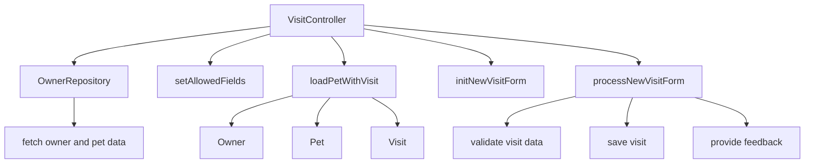

# Overview

The <SwmToken path="src/main/java/org/springframework/samples/petclinic/owner/VisitController.java" pos="44:3:3" line-data="	public VisitController(OwnerRepository owners) {">`VisitController`</SwmToken> is responsible for handling the creation and management of visits for pets. It uses the <SwmToken path="src/main/java/org/springframework/samples/petclinic/owner/VisitController.java" pos="44:5:5" line-data="	public VisitController(OwnerRepository owners) {">`OwnerRepository`</SwmToken> to fetch owner and pet data, ensuring that the pet object always has an ID. The controller initializes the visit form and processes the submission of new visits, ensuring that the visit data is validated and saved, and provides feedback to the user upon successful booking.

<SwmSnippet path="/src/main/java/org/springframework/samples/petclinic/owner/VisitController.java" line="44">

---

# Initialization

The <SwmToken path="src/main/java/org/springframework/samples/petclinic/owner/VisitController.java" pos="44:3:3" line-data="	public VisitController(OwnerRepository owners) {">`VisitController`</SwmToken> is initialized with an instance of <SwmToken path="src/main/java/org/springframework/samples/petclinic/owner/VisitController.java" pos="44:5:5" line-data="	public VisitController(OwnerRepository owners) {">`OwnerRepository`</SwmToken>, which is used to fetch owner and pet data.

```java
	public VisitController(OwnerRepository owners) {
		this.owners = owners;
	}
```

---

</SwmSnippet>

<SwmSnippet path="/src/main/java/org/springframework/samples/petclinic/owner/VisitController.java" line="48">

---

# Setting Allowed Fields

The <SwmToken path="src/main/java/org/springframework/samples/petclinic/owner/VisitController.java" pos="49:5:5" line-data="	public void setAllowedFields(WebDataBinder dataBinder) {">`setAllowedFields`</SwmToken> method ensures that the 'id' field is disallowed during data binding to prevent malicious users from manipulating it.

```java
	@InitBinder
	public void setAllowedFields(WebDataBinder dataBinder) {
		dataBinder.setDisallowedFields("id");
	}
```

---

</SwmSnippet>

<SwmSnippet path="/src/main/java/org/springframework/samples/petclinic/owner/VisitController.java" line="60">

---

# Loading Pet with Visit

The <SwmToken path="src/main/java/org/springframework/samples/petclinic/owner/VisitController.java" pos="61:5:5" line-data="	public Visit loadPetWithVisit(@PathVariable(&quot;ownerId&quot;) int ownerId, @PathVariable(&quot;petId&quot;) int petId,">`loadPetWithVisit`</SwmToken> method is called before each request mapping method to ensure fresh data and that the Pet object always has an ID. It fetches the owner and pet data, adds a new visit to the pet, and returns the visit object.

```java
	@ModelAttribute("visit")
	public Visit loadPetWithVisit(@PathVariable("ownerId") int ownerId, @PathVariable("petId") int petId,
			Map<String, Object> model) {
		Owner owner = this.owners.findById(ownerId);

		Pet pet = owner.getPet(petId);
		model.put("pet", pet);
		model.put("owner", owner);

		Visit visit = new Visit();
		pet.addVisit(visit);
		return visit;
	}
```

---

</SwmSnippet>

<SwmSnippet path="/src/main/java/org/springframework/samples/petclinic/owner/VisitController.java" line="76">

---

# Initializing New Visit Form

The <SwmToken path="src/main/java/org/springframework/samples/petclinic/owner/VisitController.java" pos="77:5:5" line-data="	public String initNewVisitForm() {">`initNewVisitForm`</SwmToken> method initializes the form for creating a new visit. It returns the view name for the visit creation form.

```java
	@GetMapping("/owners/{ownerId}/pets/{petId}/visits/new")
	public String initNewVisitForm() {
		return "pets/createOrUpdateVisitForm";
	}
```

---

</SwmSnippet>

<SwmSnippet path="/src/main/java/org/springframework/samples/petclinic/owner/VisitController.java" line="83">

---

# Processing New Visit Form

The <SwmToken path="src/main/java/org/springframework/samples/petclinic/owner/VisitController.java" pos="84:5:5" line-data="	public String processNewVisitForm(@ModelAttribute Owner owner, @PathVariable int petId, @Valid Visit visit,">`processNewVisitForm`</SwmToken> method handles the form submission for creating a new visit. It validates the visit data, saves the visit to the owner's pet, and provides feedback to the user upon successful booking. If there are validation errors, it returns the visit creation form view.

```java
	@PostMapping("/owners/{ownerId}/pets/{petId}/visits/new")
	public String processNewVisitForm(@ModelAttribute Owner owner, @PathVariable int petId, @Valid Visit visit,
			BindingResult result, RedirectAttributes redirectAttributes) {
		if (result.hasErrors()) {
			return "pets/createOrUpdateVisitForm";
		}

		owner.addVisit(petId, visit);
		this.owners.save(owner);
		redirectAttributes.addFlashAttribute("message", "Your visit has been booked");
		return "redirect:/owners/{ownerId}";
	}
```

---

</SwmSnippet>

&nbsp;

*This is an auto-generated document by Swimm AI 🌊 and has not yet been verified by a human*

<SwmMeta version="3.0.0" repo-id="Z2l0aHViJTNBJTNBc3ByaW5nLXBldGNsaW5pYyUzQSUzQVN3aW1tLURlbW8=" repo-name="spring-petclinic"><sup>Powered by [Swimm](/)</sup></SwmMeta>
