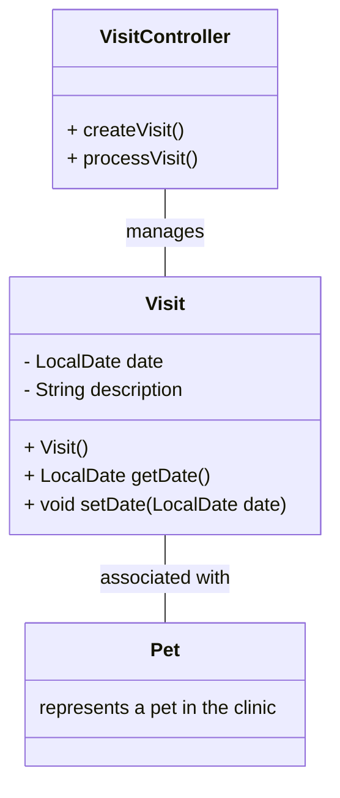

# Overview

The <SwmToken path="src/main/java/org/springframework/samples/petclinic/owner/Visit.java" pos="36:4:4" line-data="public class Visit extends BaseEntity {">`Visit`</SwmToken> class in the Spring <SwmToken path="src/main/java/org/springframework/samples/petclinic/owner/Visit.java" pos="16:8:8" line-data="package org.springframework.samples.petclinic.owner;">`petclinic`</SwmToken> application represents a record of a pet's visit to the clinic. It includes details such as the date of the visit and a description of the visit. This document explores how visits are managed within the context of owner management.

<SwmSnippet path="/src/main/java/org/springframework/samples/petclinic/owner/Visit.java" line="36">

---

# Visit Class

The <SwmToken path="src/main/java/org/springframework/samples/petclinic/owner/Visit.java" pos="36:4:4" line-data="public class Visit extends BaseEntity {">`Visit`</SwmToken> class includes fields for the visit date and a description of the visit. The visit date is formatted using <SwmToken path="src/main/java/org/springframework/samples/petclinic/owner/Visit.java" pos="39:1:2" line-data="	@DateTimeFormat(pattern = &quot;yyyy-MM-dd&quot;)">`@DateTimeFormat`</SwmToken> and defaults to the current date when a new <SwmToken path="src/main/java/org/springframework/samples/petclinic/owner/Visit.java" pos="36:4:4" line-data="public class Visit extends BaseEntity {">`Visit`</SwmToken> instance is created. The description field is marked as <SwmToken path="src/main/java/org/springframework/samples/petclinic/owner/Visit.java" pos="42:1:2" line-data="	@NotBlank">`@NotBlank`</SwmToken> to ensure it is always provided.

```java
public class Visit extends BaseEntity {

	@Column(name = "visit_date")
	@DateTimeFormat(pattern = "yyyy-MM-dd")
	private LocalDate date;

	@NotBlank
	private String description;

	/**
	 * Creates a new instance of Visit for the current date
	 */
	public Visit() {
		this.date = LocalDate.now();
	}

	public LocalDate getDate() {
		return this.date;
	}

	public void setDate(LocalDate date) {
```

---

</SwmSnippet>

<SwmSnippet path="/src/main/java/org/springframework/samples/petclinic/owner/Visit.java" line="42">

---

# Description Field

The <SwmToken path="src/main/java/org/springframework/samples/petclinic/owner/Visit.java" pos="43:5:5" line-data="	private String description;">`description`</SwmToken> field holds a brief description of the visit and is marked as <SwmToken path="src/main/java/org/springframework/samples/petclinic/owner/Visit.java" pos="42:1:2" line-data="	@NotBlank">`@NotBlank`</SwmToken> to ensure it is always provided.

```java
	@NotBlank
	private String description;
```

---

</SwmSnippet>

# Managing Visits

Visits are managed through various parts of the application, including the `VisitController`, which handles the creation and processing of new visit records. Visit data is displayed in the user interface, allowing pet owners and clinic staff to view and manage the visit history of pets.

&nbsp;

*This is an auto-generated document by Swimm AI 🌊 and has not yet been verified by a human*

<SwmMeta version="3.0.0" repo-id="Z2l0aHViJTNBJTNBc3ByaW5nLXBldGNsaW5pYyUzQSUzQVN3aW1tLURlbW8=" repo-name="spring-petclinic"><sup>Powered by [Swimm](/)</sup></SwmMeta>
