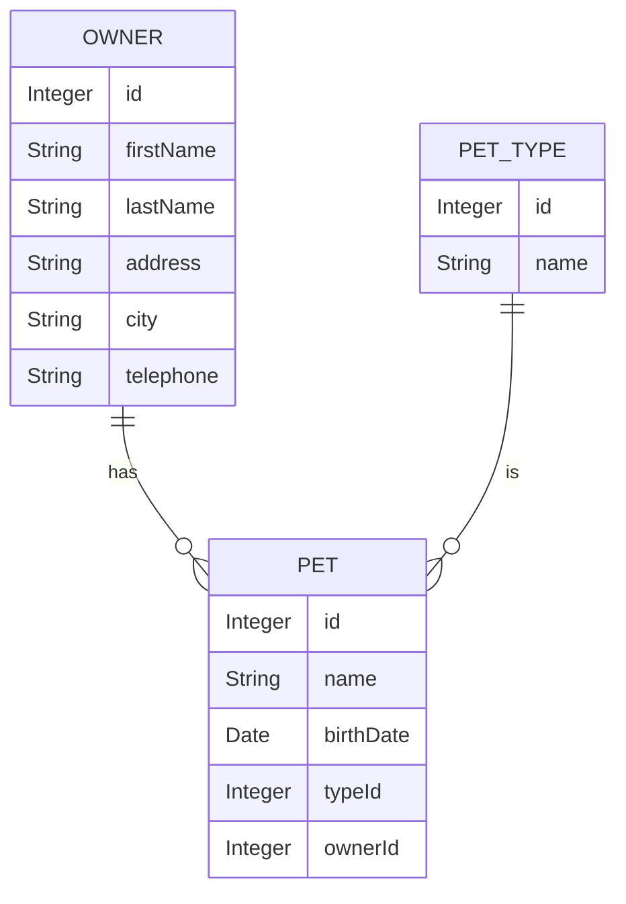

# Overview

The Owner repository is an interface that extends the Spring Data Repository for managing Owner domain objects. It provides methods to retrieve, save, and query Owner entities from the data store.

# Retrieving Owners by Last Name

The <SwmToken path="src/main/java/org/springframework/samples/petclinic/owner/OwnerRepository.java" pos="58:6:6" line-data="	Page&lt;Owner&gt; findByLastName(@Param(&quot;lastName&quot;) String lastName, Pageable pageable);">`findByLastName`</SwmToken> method retrieves owners whose last name starts with the given name. This is useful for searching for owners based on partial last name matches.

<SwmSnippet path="/src/main/java/org/springframework/samples/petclinic/owner/OwnerRepository.java" line="56">

---

The <SwmToken path="src/main/java/org/springframework/samples/petclinic/owner/OwnerRepository.java" pos="58:6:6" line-data="	Page&lt;Owner&gt; findByLastName(@Param(&quot;lastName&quot;) String lastName, Pageable pageable);">`findByLastName`</SwmToken> method uses a query to search for owners and returns a pageable list of matching owners.

```java
	@Query("SELECT DISTINCT owner FROM Owner owner left join  owner.pets WHERE owner.lastName LIKE :lastName% ")
	@Transactional(readOnly = true)
	Page<Owner> findByLastName(@Param("lastName") String lastName, Pageable pageable);
```

---

</SwmSnippet>

# Fetching Owner by ID

The <SwmToken path="src/main/java/org/springframework/samples/petclinic/owner/OwnerRepository.java" pos="67:3:3" line-data="	Owner findById(@Param(&quot;id&quot;) Integer id);">`findById`</SwmToken> method fetches an owner by their ID, including their pets. This is useful for retrieving detailed information about a specific owner.

<SwmSnippet path="/src/main/java/org/springframework/samples/petclinic/owner/OwnerRepository.java" line="65">

---

The <SwmToken path="src/main/java/org/springframework/samples/petclinic/owner/OwnerRepository.java" pos="67:3:3" line-data="	Owner findById(@Param(&quot;id&quot;) Integer id);">`findById`</SwmToken> method uses a query to join the owner with their pets and returns the owner if found.

```java
	@Query("SELECT owner FROM Owner owner left join fetch owner.pets WHERE owner.id =:id")
	@Transactional(readOnly = true)
	Owner findById(@Param("id") Integer id);
```

---

</SwmSnippet>

# Saving an Owner

The <SwmToken path="src/main/java/org/springframework/samples/petclinic/owner/OwnerRepository.java" pos="70:3:3" line-data="	 * Save an {@link Owner} to the data store, either inserting or updating it.">`Save`</SwmToken> method inserts or updates an owner in the data store. This is used for both creating new owners and updating existing ones.

<SwmSnippet path="/src/main/java/org/springframework/samples/petclinic/owner/OwnerRepository.java" line="69">

---

The <SwmToken path="src/main/java/org/springframework/samples/petclinic/owner/OwnerRepository.java" pos="70:3:3" line-data="	 * Save an {@link Owner} to the data store, either inserting or updating it.">`Save`</SwmToken> method is annotated to save an <SwmToken path="src/main/java/org/springframework/samples/petclinic/owner/OwnerRepository.java" pos="70:11:11" line-data="	 * Save an {@link Owner} to the data store, either inserting or updating it.">`Owner`</SwmToken> to the data store, either inserting or updating it.

```java
	/**
	 * Save an {@link Owner} to the data store, either inserting or updating it.
	 * @param owner the {@link Owner} to save
	 */
	void save(Owner owner);
```

---

</SwmSnippet>

# Retrieving All Owners

The <SwmToken path="src/main/java/org/springframework/samples/petclinic/owner/OwnerRepository.java" pos="80:6:6" line-data="	Page&lt;Owner&gt; findAll(Pageable pageable);">`findAll`</SwmToken> method returns all owners from the data store. This is useful for listing all owners in the system.

<SwmSnippet path="/src/main/java/org/springframework/samples/petclinic/owner/OwnerRepository.java" line="78">

---

The <SwmToken path="src/main/java/org/springframework/samples/petclinic/owner/OwnerRepository.java" pos="80:6:6" line-data="	Page&lt;Owner&gt; findAll(Pageable pageable);">`findAll`</SwmToken> method uses a query to return a pageable list of all owners.

```java
	@Query("SELECT owner FROM Owner owner")
	@Transactional(readOnly = true)
	Page<Owner> findAll(Pageable pageable);
```

---

</SwmSnippet>

# Retrieving Pet Types

The <SwmToken path="src/main/java/org/springframework/samples/petclinic/owner/OwnerRepository.java" pos="46:6:6" line-data="	List&lt;PetType&gt; findPetTypes();">`findPetTypes`</SwmToken> method retrieves all pet types from the data store. This is useful for populating dropdowns or lists of pet types.

<SwmSnippet path="/src/main/java/org/springframework/samples/petclinic/owner/OwnerRepository.java" line="44">

---

The <SwmToken path="src/main/java/org/springframework/samples/petclinic/owner/OwnerRepository.java" pos="46:6:6" line-data="	List&lt;PetType&gt; findPetTypes();">`findPetTypes`</SwmToken> method uses a query to return a list of all pet types ordered by name.

```java
	@Query("SELECT ptype FROM PetType ptype ORDER BY ptype.name")
	@Transactional(readOnly = true)
	List<PetType> findPetTypes();
```

---

</SwmSnippet>

&nbsp;

*This is an auto-generated document by Swimm AI 🌊 and has not yet been verified by a human*

<SwmMeta version="3.0.0" repo-id="Z2l0aHViJTNBJTNBc3ByaW5nLXBldGNsaW5pYyUzQSUzQVN3aW1tLURlbW8=" repo-name="spring-petclinic"><sup>Powered by [Swimm](/)</sup></SwmMeta>
