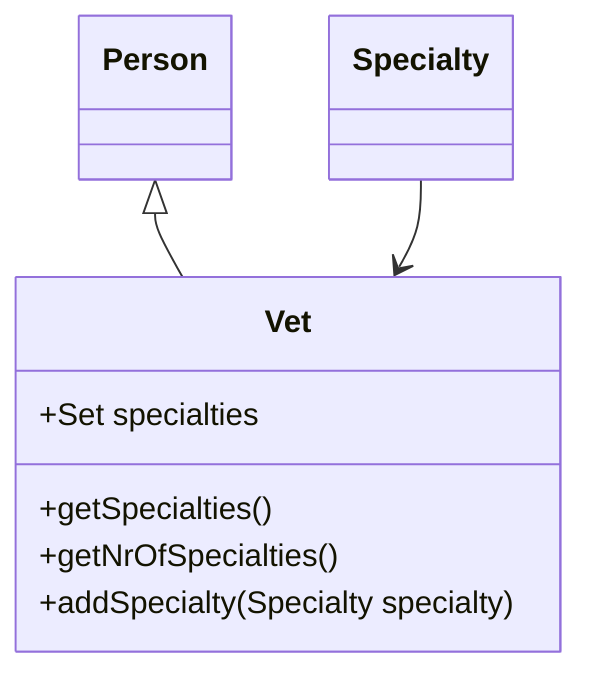

# Overview

The <SwmToken path="src/main/java/org/springframework/samples/petclinic/vet/Vet.java" pos="16:10:10" line-data="package org.springframework.samples.petclinic.vet;">`vet`</SwmToken> class represents a veterinarian in the system. It extends the <SwmToken path="src/main/java/org/springframework/samples/petclinic/vet/Vet.java" pos="26:12:12" line-data="import org.springframework.samples.petclinic.model.Person;">`Person`</SwmToken> class, inheriting common properties such as name and contact details. The <SwmToken path="src/main/java/org/springframework/samples/petclinic/vet/Vet.java" pos="16:10:10" line-data="package org.springframework.samples.petclinic.vet;">`vet`</SwmToken> class includes a set of specialties, which are areas of expertise for the veterinarian. These specialties are managed using a many-to-many relationship with the <SwmToken path="src/main/java/org/springframework/samples/petclinic/vet/Vet.java" pos="51:5:5" line-data="	private Set&lt;Specialty&gt; specialties;">`Specialty`</SwmToken> class.

<SwmSnippet path="/src/main/java/org/springframework/samples/petclinic/vet/Vet.java" line="48">

---

# Managing Specialties

The <SwmToken path="src/main/java/org/springframework/samples/petclinic/vet/Vet.java" pos="16:10:10" line-data="package org.springframework.samples.petclinic.vet;">`vet`</SwmToken> class uses a many-to-many relationship with the <SwmToken path="src/main/java/org/springframework/samples/petclinic/vet/Vet.java" pos="51:5:5" line-data="	private Set&lt;Specialty&gt; specialties;">`Specialty`</SwmToken> class to manage the veterinarian's areas of expertise.

```java
	@ManyToMany(fetch = FetchType.EAGER)
	@JoinTable(name = "vet_specialties", joinColumns = @JoinColumn(name = "vet_id"),
			inverseJoinColumns = @JoinColumn(name = "specialty_id"))
	private Set<Specialty> specialties;
```

---

</SwmSnippet>

<SwmSnippet path="/src/main/java/org/springframework/samples/petclinic/vet/Vet.java" line="64">

---

# Retrieving Specialties

The <SwmToken path="src/main/java/org/springframework/samples/petclinic/vet/Vet.java" pos="65:8:8" line-data="	public List&lt;Specialty&gt; getSpecialties() {">`getSpecialties`</SwmToken> method returns a sorted and unmodifiable list of the veterinarian's specialties, ensuring that the list is always presented in a consistent order.

```java
	@XmlElement
	public List<Specialty> getSpecialties() {
		List<Specialty> sortedSpecs = new ArrayList<>(getSpecialtiesInternal());
		PropertyComparator.sort(sortedSpecs, new MutableSortDefinition("name", true, true));
		return Collections.unmodifiableList(sortedSpecs);
	}
```

---

</SwmSnippet>

<SwmSnippet path="/src/main/java/org/springframework/samples/petclinic/vet/Vet.java" line="71">

---

# Counting Specialties

The <SwmToken path="src/main/java/org/springframework/samples/petclinic/vet/Vet.java" pos="71:5:5" line-data="	public int getNrOfSpecialties() {">`getNrOfSpecialties`</SwmToken> method provides the number of specialties associated with the veterinarian, which can be useful for displaying summary information.

```java
	public int getNrOfSpecialties() {
		return getSpecialtiesInternal().size();
	}
```

---

</SwmSnippet>

<SwmSnippet path="/src/main/java/org/springframework/samples/petclinic/vet/Vet.java" line="75">

---

# Adding Specialties

The <SwmToken path="src/main/java/org/springframework/samples/petclinic/vet/Vet.java" pos="75:5:5" line-data="	public void addSpecialty(Specialty specialty) {">`addSpecialty`</SwmToken> method allows adding a new specialty to the veterinarian's set of specialties, enabling dynamic updates to their areas of expertise.

```java
	public void addSpecialty(Specialty specialty) {
		getSpecialtiesInternal().add(specialty);
	}
```

---

</SwmSnippet>

&nbsp;

*This is an auto-generated document by Swimm AI 🌊 and has not yet been verified by a human*

<SwmMeta version="3.0.0" repo-id="Z2l0aHViJTNBJTNBc3ByaW5nLXBldGNsaW5pYyUzQSUzQVN3aW1tLURlbW8=" repo-name="spring-petclinic"><sup>Powered by [Swimm](/)</sup></SwmMeta>
