```mermaid
classDiagram
    PetController <|-- OwnerRepository
    PetController : +populatePetTypes()
    PetController : +findOwner(int ownerId)
    PetController : +findPet(int ownerId, Integer petId)
    PetController : +initOwnerBinder(WebDataBinder dataBinder)
    PetController : +initPetBinder(WebDataBinder dataBinder)
    PetController : +initCreationForm(Owner owner, ModelMap model)
    PetController : +processCreationForm(Owner owner, @Valid Pet pet, BindingResult result, ModelMap model, RedirectAttributes RedirectAttributes)
    PetController : +initUpdateForm(Owner owner, int petId, ModelMap model, RedirectAttributes RedirectAttributes)
    PetController : +processUpdateForm(@Valid Pet pet, BindingResult result, Owner owner, ModelMap model, RedirectAttributes RedirectAttributes)
    class OwnerRepository {
        +findPetTypes() : Collection<PetType>
        +findById(int ownerId) : Owner
        +save(Owner owner)
    }
    class Pet {
        +isNew() : boolean
        +getName() : String
        +getBirthDate() : LocalDate
    }
    class Owner {
        +addPet(Pet pet)
        +getPet(int petId) : Pet
        +getPet(String name, boolean ignoreNew) : Pet
    }

%% Swimm:
%% classDiagram
%%     <SwmToken path="src/main/java/org/springframework/samples/petclinic/owner/PetController.java" pos="43:2:2" line-data="class PetController {">`PetController`</SwmToken> <|-- <SwmToken path="src/main/java/org/springframework/samples/petclinic/owner/PetController.java" pos="49:5:5" line-data="	public PetController(OwnerRepository owners) {">`OwnerRepository`</SwmToken>
%%     <SwmToken path="src/main/java/org/springframework/samples/petclinic/owner/PetController.java" pos="43:2:2" line-data="class PetController {">`PetController`</SwmToken> : +populatePetTypes()
%%     <SwmToken path="src/main/java/org/springframework/samples/petclinic/owner/PetController.java" pos="43:2:2" line-data="class PetController {">`PetController`</SwmToken> : +findOwner(int <SwmToken path="src/main/java/org/springframework/samples/petclinic/owner/PetController.java" pos="42:8:8" line-data="@RequestMapping(&quot;/owners/{ownerId}&quot;)">`ownerId`</SwmToken>)
%%     <SwmToken path="src/main/java/org/springframework/samples/petclinic/owner/PetController.java" pos="43:2:2" line-data="class PetController {">`PetController`</SwmToken> : +findPet(int <SwmToken path="src/main/java/org/springframework/samples/petclinic/owner/PetController.java" pos="42:8:8" line-data="@RequestMapping(&quot;/owners/{ownerId}&quot;)">`ownerId`</SwmToken>, Integer <SwmToken path="src/main/java/org/springframework/samples/petclinic/owner/PetController.java" pos="70:9:9" line-data="			@PathVariable(name = &quot;petId&quot;, required = false) Integer petId) {">`petId`</SwmToken>)
%%     <SwmToken path="src/main/java/org/springframework/samples/petclinic/owner/PetController.java" pos="43:2:2" line-data="class PetController {">`PetController`</SwmToken> : +initOwnerBinder(WebDataBinder <SwmToken path="src/main/java/org/springframework/samples/petclinic/owner/PetController.java" pos="84:9:9" line-data="	public void initOwnerBinder(WebDataBinder dataBinder) {">`dataBinder`</SwmToken>)
%%     <SwmToken path="src/main/java/org/springframework/samples/petclinic/owner/PetController.java" pos="43:2:2" line-data="class PetController {">`PetController`</SwmToken> : +initPetBinder(WebDataBinder <SwmToken path="src/main/java/org/springframework/samples/petclinic/owner/PetController.java" pos="84:9:9" line-data="	public void initOwnerBinder(WebDataBinder dataBinder) {">`dataBinder`</SwmToken>)
%%     <SwmToken path="src/main/java/org/springframework/samples/petclinic/owner/PetController.java" pos="43:2:2" line-data="class PetController {">`PetController`</SwmToken> : +initCreationForm(Owner owner, <SwmToken path="src/main/java/org/springframework/samples/petclinic/owner/PetController.java" pos="94:12:12" line-data="	public String initCreationForm(Owner owner, ModelMap model) {">`ModelMap`</SwmToken> model)
%%     <SwmToken path="src/main/java/org/springframework/samples/petclinic/owner/PetController.java" pos="43:2:2" line-data="class PetController {">`PetController`</SwmToken> : +processCreationForm(Owner owner, @Valid Pet pet, <SwmToken path="src/main/java/org/springframework/samples/petclinic/owner/PetController.java" pos="102:20:20" line-data="	public String processCreationForm(Owner owner, @Valid Pet pet, BindingResult result, ModelMap model,">`BindingResult`</SwmToken> result, <SwmToken path="src/main/java/org/springframework/samples/petclinic/owner/PetController.java" pos="94:12:12" line-data="	public String initCreationForm(Owner owner, ModelMap model) {">`ModelMap`</SwmToken> model, <SwmToken path="src/main/java/org/springframework/samples/petclinic/owner/PetController.java" pos="103:1:1" line-data="			RedirectAttributes redirectAttributes) {">`RedirectAttributes`</SwmToken> <SwmToken path="src/main/java/org/springframework/samples/petclinic/owner/PetController.java" pos="103:1:1" line-data="			RedirectAttributes redirectAttributes) {">`RedirectAttributes`</SwmToken>)
%%     <SwmToken path="src/main/java/org/springframework/samples/petclinic/owner/PetController.java" pos="43:2:2" line-data="class PetController {">`PetController`</SwmToken> : +initUpdateForm(Owner owner, int <SwmToken path="src/main/java/org/springframework/samples/petclinic/owner/PetController.java" pos="70:9:9" line-data="			@PathVariable(name = &quot;petId&quot;, required = false) Integer petId) {">`petId`</SwmToken>, <SwmToken path="src/main/java/org/springframework/samples/petclinic/owner/PetController.java" pos="94:12:12" line-data="	public String initCreationForm(Owner owner, ModelMap model) {">`ModelMap`</SwmToken> model, <SwmToken path="src/main/java/org/springframework/samples/petclinic/owner/PetController.java" pos="103:1:1" line-data="			RedirectAttributes redirectAttributes) {">`RedirectAttributes`</SwmToken> <SwmToken path="src/main/java/org/springframework/samples/petclinic/owner/PetController.java" pos="103:1:1" line-data="			RedirectAttributes redirectAttributes) {">`RedirectAttributes`</SwmToken>)
%%     <SwmToken path="src/main/java/org/springframework/samples/petclinic/owner/PetController.java" pos="43:2:2" line-data="class PetController {">`PetController`</SwmToken> : +processUpdateForm(@Valid Pet pet, <SwmToken path="src/main/java/org/springframework/samples/petclinic/owner/PetController.java" pos="102:20:20" line-data="	public String processCreationForm(Owner owner, @Valid Pet pet, BindingResult result, ModelMap model,">`BindingResult`</SwmToken> result, Owner owner, <SwmToken path="src/main/java/org/springframework/samples/petclinic/owner/PetController.java" pos="94:12:12" line-data="	public String initCreationForm(Owner owner, ModelMap model) {">`ModelMap`</SwmToken> model, <SwmToken path="src/main/java/org/springframework/samples/petclinic/owner/PetController.java" pos="103:1:1" line-data="			RedirectAttributes redirectAttributes) {">`RedirectAttributes`</SwmToken> <SwmToken path="src/main/java/org/springframework/samples/petclinic/owner/PetController.java" pos="103:1:1" line-data="			RedirectAttributes redirectAttributes) {">`RedirectAttributes`</SwmToken>)
%%     class <SwmToken path="src/main/java/org/springframework/samples/petclinic/owner/PetController.java" pos="49:5:5" line-data="	public PetController(OwnerRepository owners) {">`OwnerRepository`</SwmToken> {
%%         +findPetTypes() : <SwmToken path="src/main/java/org/springframework/samples/petclinic/owner/PetController.java" pos="54:3:6" line-data="	public Collection&lt;PetType&gt; populatePetTypes() {">`Collection<PetType>`</SwmToken>
%%         +findById(int <SwmToken path="src/main/java/org/springframework/samples/petclinic/owner/PetController.java" pos="42:8:8" line-data="@RequestMapping(&quot;/owners/{ownerId}&quot;)">`ownerId`</SwmToken>) : Owner
%%         +save(Owner owner)
%%     }
%%     class Pet {
%%         +isNew() : boolean
%%         +getName() : String
%%         +getBirthDate() : <SwmToken path="src/main/java/org/springframework/samples/petclinic/owner/PetController.java" pos="108:1:1" line-data="		LocalDate currentDate = LocalDate.now();">`LocalDate`</SwmToken>
%%     }
%%     class Owner {
%%         +addPet(Pet pet)
%%         +getPet(int <SwmToken path="src/main/java/org/springframework/samples/petclinic/owner/PetController.java" pos="70:9:9" line-data="			@PathVariable(name = &quot;petId&quot;, required = false) Integer petId) {">`petId`</SwmToken>) : Pet
%%         +getPet(String name, boolean ignoreNew) : Pet
%%     }
```

# <SwmToken path="src/main/java/org/springframework/samples/petclinic/owner/PetController.java" pos="43:2:2" line-data="class PetController {">`PetController`</SwmToken> Overview

The <SwmToken path="src/main/java/org/springframework/samples/petclinic/owner/PetController.java" pos="43:2:2" line-data="class PetController {">`PetController`</SwmToken> is responsible for handling HTTP requests related to pet management for a specific owner. It provides methods to create, update, and retrieve pet information, ensuring that each pet is associated with the correct owner.

<SwmSnippet path="/src/main/java/org/springframework/samples/petclinic/owner/PetController.java" line="41">

---

# Class Annotations

The <SwmToken path="src/main/java/org/springframework/samples/petclinic/owner/PetController.java" pos="43:2:2" line-data="class PetController {">`PetController`</SwmToken> class is annotated with <SwmToken path="src/main/java/org/springframework/samples/petclinic/owner/PetController.java" pos="41:0:1" line-data="@Controller">`@Controller`</SwmToken> and <SwmToken path="src/main/java/org/springframework/samples/petclinic/owner/PetController.java" pos="42:0:1" line-data="@RequestMapping(&quot;/owners/{ownerId}&quot;)">`@RequestMapping`</SwmToken> to handle requests for pet management.

```java
@Controller
@RequestMapping("/owners/{ownerId}")
class PetController {
```

---

</SwmSnippet>

<SwmSnippet path="/src/main/java/org/springframework/samples/petclinic/owner/PetController.java" line="49">

---

# Constructor

The constructor initializes the <SwmToken path="src/main/java/org/springframework/samples/petclinic/owner/PetController.java" pos="49:5:5" line-data="	public PetController(OwnerRepository owners) {">`OwnerRepository`</SwmToken> which is used to interact with the database.

```java
	public PetController(OwnerRepository owners) {
		this.owners = owners;
	}
```

---

</SwmSnippet>

# Model Attributes

The <SwmToken path="src/main/java/org/springframework/samples/petclinic/owner/PetController.java" pos="53:1:2" line-data="	@ModelAttribute(&quot;types&quot;)">`@ModelAttribute`</SwmToken> annotated methods populate the model with necessary data.

<SwmSnippet path="/src/main/java/org/springframework/samples/petclinic/owner/PetController.java" line="53">

---

The <SwmToken path="src/main/java/org/springframework/samples/petclinic/owner/PetController.java" pos="54:8:8" line-data="	public Collection&lt;PetType&gt; populatePetTypes() {">`populatePetTypes`</SwmToken> method populates the model with pet types.

```java
	@ModelAttribute("types")
	public Collection<PetType> populatePetTypes() {
		return this.owners.findPetTypes();
	}
```

---

</SwmSnippet>

<SwmSnippet path="/src/main/java/org/springframework/samples/petclinic/owner/PetController.java" line="58">

---

The <SwmToken path="src/main/java/org/springframework/samples/petclinic/owner/PetController.java" pos="59:5:5" line-data="	public Owner findOwner(@PathVariable(&quot;ownerId&quot;) int ownerId) {">`findOwner`</SwmToken> method retrieves the owner by ID and adds it to the model.

```java
	@ModelAttribute("owner")
	public Owner findOwner(@PathVariable("ownerId") int ownerId) {

		Owner owner = this.owners.findById(ownerId);
		if (owner == null) {
			throw new IllegalArgumentException("Owner ID not found: " + ownerId);
		}
		return owner;
	}
```

---

</SwmSnippet>

<SwmSnippet path="/src/main/java/org/springframework/samples/petclinic/owner/PetController.java" line="68">

---

The <SwmToken path="src/main/java/org/springframework/samples/petclinic/owner/PetController.java" pos="69:5:5" line-data="	public Pet findPet(@PathVariable(&quot;ownerId&quot;) int ownerId,">`findPet`</SwmToken> method retrieves the pet by ID if it exists, otherwise creates a new pet.

```java
	@ModelAttribute("pet")
	public Pet findPet(@PathVariable("ownerId") int ownerId,
			@PathVariable(name = "petId", required = false) Integer petId) {

		if (petId == null) {
			return new Pet();
		}

		Owner owner = this.owners.findById(ownerId);
		if (owner == null) {
			throw new IllegalArgumentException("Owner ID not found: " + ownerId);
		}
		return owner.getPet(petId);
	}
```

---

</SwmSnippet>

# <SwmToken path="src/main/java/org/springframework/samples/petclinic/owner/PetController.java" pos="83:2:2" line-data="	@InitBinder(&quot;owner&quot;)">`InitBinder`</SwmToken> Methods

The <SwmToken path="src/main/java/org/springframework/samples/petclinic/owner/PetController.java" pos="83:1:2" line-data="	@InitBinder(&quot;owner&quot;)">`@InitBinder`</SwmToken> annotated methods initialize data binders for validation.

<SwmSnippet path="/src/main/java/org/springframework/samples/petclinic/owner/PetController.java" line="83">

---

The <SwmToken path="src/main/java/org/springframework/samples/petclinic/owner/PetController.java" pos="84:5:5" line-data="	public void initOwnerBinder(WebDataBinder dataBinder) {">`initOwnerBinder`</SwmToken> method initializes the data binder for the owner, disallowing the 'id' field.

```java
	@InitBinder("owner")
	public void initOwnerBinder(WebDataBinder dataBinder) {
		dataBinder.setDisallowedFields("id");
	}
```

---

</SwmSnippet>

<SwmSnippet path="/src/main/java/org/springframework/samples/petclinic/owner/PetController.java" line="88">

---

The <SwmToken path="src/main/java/org/springframework/samples/petclinic/owner/PetController.java" pos="89:5:5" line-data="	public void initPetBinder(WebDataBinder dataBinder) {">`initPetBinder`</SwmToken> method initializes the data binder for the pet, setting a custom validator.

```java
	@InitBinder("pet")
	public void initPetBinder(WebDataBinder dataBinder) {
		dataBinder.setValidator(new PetValidator());
	}
```

---

</SwmSnippet>

# Creation Methods

The methods for creating a new pet include initializing the creation form and processing the form submission.

<SwmSnippet path="/src/main/java/org/springframework/samples/petclinic/owner/PetController.java" line="93">

---

The <SwmToken path="src/main/java/org/springframework/samples/petclinic/owner/PetController.java" pos="94:5:5" line-data="	public String initCreationForm(Owner owner, ModelMap model) {">`initCreationForm`</SwmToken> method initializes the form for creating a new pet.

```java
	@GetMapping("/pets/new")
	public String initCreationForm(Owner owner, ModelMap model) {
		Pet pet = new Pet();
		owner.addPet(pet);
		model.put("pet", pet);
		return VIEWS_PETS_CREATE_OR_UPDATE_FORM;
	}
```

---

</SwmSnippet>

<SwmSnippet path="/src/main/java/org/springframework/samples/petclinic/owner/PetController.java" line="101">

---

The <SwmToken path="src/main/java/org/springframework/samples/petclinic/owner/PetController.java" pos="102:5:5" line-data="	public String processCreationForm(Owner owner, @Valid Pet pet, BindingResult result, ModelMap model,">`processCreationForm`</SwmToken> method processes the form submission for creating a new pet, performing validation and saving the pet.

```java
	@PostMapping("/pets/new")
	public String processCreationForm(Owner owner, @Valid Pet pet, BindingResult result, ModelMap model,
			RedirectAttributes redirectAttributes) {
		if (StringUtils.hasText(pet.getName()) && pet.isNew() && owner.getPet(pet.getName(), true) != null) {
			result.rejectValue("name", "duplicate", "already exists");
		}

		LocalDate currentDate = LocalDate.now();
		if (pet.getBirthDate() != null && pet.getBirthDate().isAfter(currentDate)) {
			result.rejectValue("birthDate", "typeMismatch.birthDate");
		}

		owner.addPet(pet);
		if (result.hasErrors()) {
			model.put("pet", pet);
			return VIEWS_PETS_CREATE_OR_UPDATE_FORM;
		}

		this.owners.save(owner);
		redirectAttributes.addFlashAttribute("message", "New Pet has been Added");
		return "redirect:/owners/{ownerId}";
```

---

</SwmSnippet>

# Update Methods

The methods for updating an existing pet include initializing the update form and processing the form submission.

<SwmSnippet path="/src/main/java/org/springframework/samples/petclinic/owner/PetController.java" line="124">

---

The <SwmToken path="src/main/java/org/springframework/samples/petclinic/owner/PetController.java" pos="125:5:5" line-data="	public String initUpdateForm(Owner owner, @PathVariable(&quot;petId&quot;) int petId, ModelMap model,">`initUpdateForm`</SwmToken> method initializes the form for updating an existing pet.

```java
	@GetMapping("/pets/{petId}/edit")
	public String initUpdateForm(Owner owner, @PathVariable("petId") int petId, ModelMap model,
			RedirectAttributes redirectAttributes) {
		Pet pet = owner.getPet(petId);
		model.put("pet", pet);
		return VIEWS_PETS_CREATE_OR_UPDATE_FORM;
	}
```

---

</SwmSnippet>

<SwmSnippet path="/src/main/java/org/springframework/samples/petclinic/owner/PetController.java" line="132">

---

The <SwmToken path="src/main/java/org/springframework/samples/petclinic/owner/PetController.java" pos="133:5:5" line-data="	public String processUpdateForm(@Valid Pet pet, BindingResult result, Owner owner, ModelMap model,">`processUpdateForm`</SwmToken> method processes the form submission for updating an existing pet, performing validation and saving the pet.

```java
	@PostMapping("/pets/{petId}/edit")
	public String processUpdateForm(@Valid Pet pet, BindingResult result, Owner owner, ModelMap model,
			RedirectAttributes redirectAttributes) {

		String petName = pet.getName();

		// checking if the pet name already exist for the owner
		if (StringUtils.hasText(petName)) {
			Pet existingPet = owner.getPet(petName.toLowerCase(), false);
			if (existingPet != null && existingPet.getId() != pet.getId()) {
				result.rejectValue("name", "duplicate", "already exists");
			}
		}

		LocalDate currentDate = LocalDate.now();
		if (pet.getBirthDate() != null && pet.getBirthDate().isAfter(currentDate)) {
			result.rejectValue("birthDate", "typeMismatch.birthDate");
		}

		if (result.hasErrors()) {
			model.put("pet", pet);
```

---

</SwmSnippet>

&nbsp;

*This is an auto-generated document by Swimm AI 🌊 and has not yet been verified by a human*

<SwmMeta version="3.0.0" repo-id="Z2l0aHViJTNBJTNBc3ByaW5nLXBldGNsaW5pYyUzQSUzQVN3aW1tLURlbW8=" repo-name="spring-petclinic"><sup>Powered by [Swimm](/)</sup></SwmMeta>
