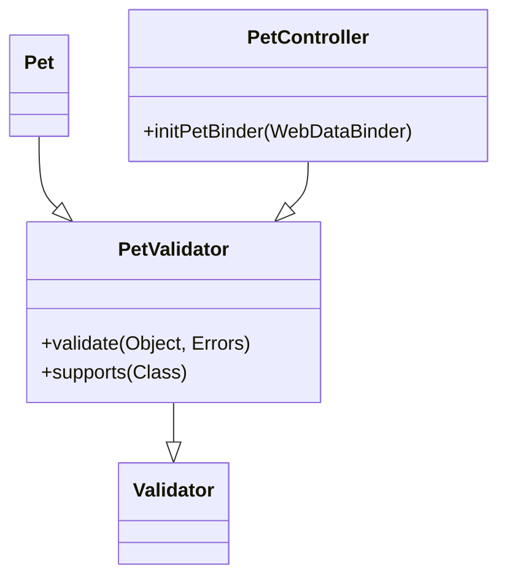

# Overview

The <SwmToken path="src/main/java/org/springframework/samples/petclinic/owner/PetValidator.java" pos="32:4:4" line-data="public class PetValidator implements Validator {">`PetValidator`</SwmToken> class is responsible for validating <SwmToken path="src/main/java/org/springframework/samples/petclinic/owner/PetValidator.java" pos="23:16:16" line-data=" * &lt;code&gt;Validator&lt;/code&gt; for &lt;code&gt;Pet&lt;/code&gt; forms.">`Pet`</SwmToken> instances in the application. It ensures that the <SwmToken path="src/main/java/org/springframework/samples/petclinic/owner/PetValidator.java" pos="23:16:16" line-data=" * &lt;code&gt;Validator&lt;/code&gt; for &lt;code&gt;Pet&lt;/code&gt; forms.">`Pet`</SwmToken>'s name, type, and birth date fields are correctly populated. This validation logic helps maintain data integrity and ensures that all necessary information is provided when managing pets.

# <SwmToken path="src/main/java/org/springframework/samples/petclinic/owner/PetValidator.java" pos="32:4:4" line-data="public class PetValidator implements Validator {">`PetValidator`</SwmToken> Class

The <SwmToken path="src/main/java/org/springframework/samples/petclinic/owner/PetValidator.java" pos="32:4:4" line-data="public class PetValidator implements Validator {">`PetValidator`</SwmToken> class is defined to validate <SwmToken path="src/main/java/org/springframework/samples/petclinic/owner/PetValidator.java" pos="23:16:16" line-data=" * &lt;code&gt;Validator&lt;/code&gt; for &lt;code&gt;Pet&lt;/code&gt; forms.">`Pet`</SwmToken> instances. It includes the <SwmToken path="src/main/java/org/springframework/samples/petclinic/owner/PetValidator.java" pos="37:5:5" line-data="	public void validate(Object obj, Errors errors) {">`validate`</SwmToken> method which performs the necessary checks on the <SwmToken path="src/main/java/org/springframework/samples/petclinic/owner/PetValidator.java" pos="23:16:16" line-data=" * &lt;code&gt;Validator&lt;/code&gt; for &lt;code&gt;Pet&lt;/code&gt; forms.">`Pet`</SwmToken> object.

<SwmSnippet path="/src/main/java/org/springframework/samples/petclinic/owner/PetValidator.java" line="22">

---

The <SwmToken path="src/main/java/org/springframework/samples/petclinic/owner/PetValidator.java" pos="32:4:4" line-data="public class PetValidator implements Validator {">`PetValidator`</SwmToken> class is implemented to validate <SwmToken path="src/main/java/org/springframework/samples/petclinic/owner/PetValidator.java" pos="23:16:16" line-data=" * &lt;code&gt;Validator&lt;/code&gt; for &lt;code&gt;Pet&lt;/code&gt; forms.">`Pet`</SwmToken> forms. It does not use Bean Validation annotations because it is easier to define such validation rules in Java.

```java
/**
 * <code>Validator</code> for <code>Pet</code> forms.
 * <p>
 * We're not using Bean Validation annotations here because it is easier to define such
 * validation rule in Java.
 * </p>
 *
 * @author Ken Krebs
 * @author Juergen Hoeller
 */
public class PetValidator implements Validator {
```

---

</SwmSnippet>

# Setting the Validator

The <SwmToken path="src/main/java/org/springframework/samples/petclinic/owner/PetValidator.java" pos="32:4:4" line-data="public class PetValidator implements Validator {">`PetValidator`</SwmToken> is set as a validator in the <SwmToken path="src/main/java/org/springframework/samples/petclinic/owner/PetController.java" pos="89:7:7" line-data="	public void initPetBinder(WebDataBinder dataBinder) {">`WebDataBinder`</SwmToken> within the <SwmToken path="src/main/java/org/springframework/samples/petclinic/owner/PetController.java" pos="43:2:2" line-data="class PetController {">`PetController`</SwmToken>. This ensures that the <SwmToken path="src/main/java/org/springframework/samples/petclinic/owner/PetValidator.java" pos="32:4:4" line-data="public class PetValidator implements Validator {">`PetValidator`</SwmToken> is used to validate <SwmToken path="src/main/java/org/springframework/samples/petclinic/owner/PetValidator.java" pos="23:16:16" line-data=" * &lt;code&gt;Validator&lt;/code&gt; for &lt;code&gt;Pet&lt;/code&gt; forms.">`Pet`</SwmToken> instances during form submissions.

<SwmSnippet path="/src/main/java/org/springframework/samples/petclinic/owner/PetController.java" line="89">

---

The <SwmToken path="src/main/java/org/springframework/samples/petclinic/owner/PetController.java" pos="89:5:5" line-data="	public void initPetBinder(WebDataBinder dataBinder) {">`initPetBinder`</SwmToken> method in <SwmToken path="src/main/java/org/springframework/samples/petclinic/owner/PetController.java" pos="43:2:2" line-data="class PetController {">`PetController`</SwmToken> sets the <SwmToken path="src/main/java/org/springframework/samples/petclinic/owner/PetController.java" pos="90:7:7" line-data="		dataBinder.setValidator(new PetValidator());">`PetValidator`</SwmToken> as the validator for <SwmToken path="src/main/java/org/springframework/samples/petclinic/owner/PetValidator.java" pos="23:16:16" line-data=" * &lt;code&gt;Validator&lt;/code&gt; for &lt;code&gt;Pet&lt;/code&gt; forms.">`Pet`</SwmToken> instances.

```java
	public void initPetBinder(WebDataBinder dataBinder) {
		dataBinder.setValidator(new PetValidator());
	}
```

---

</SwmSnippet>

# Main Functions

The <SwmToken path="src/main/java/org/springframework/samples/petclinic/owner/PetValidator.java" pos="32:4:4" line-data="public class PetValidator implements Validator {">`PetValidator`</SwmToken> class has two main functions: <SwmToken path="src/main/java/org/springframework/samples/petclinic/owner/PetValidator.java" pos="37:5:5" line-data="	public void validate(Object obj, Errors errors) {">`validate`</SwmToken> and <SwmToken path="src/main/java/org/springframework/samples/petclinic/owner/PetValidator.java" pos="60:5:5" line-data="	public boolean supports(Class&lt;?&gt; clazz) {">`supports`</SwmToken>.

## validate

The <SwmToken path="src/main/java/org/springframework/samples/petclinic/owner/PetValidator.java" pos="37:5:5" line-data="	public void validate(Object obj, Errors errors) {">`validate`</SwmToken> function checks if the <SwmToken path="src/main/java/org/springframework/samples/petclinic/owner/PetValidator.java" pos="23:16:16" line-data=" * &lt;code&gt;Validator&lt;/code&gt; for &lt;code&gt;Pet&lt;/code&gt; forms.">`Pet`</SwmToken>'s name is not empty, the type is specified for new pets, and the birth date is provided. If any of these validations fail, appropriate error messages are added to the <SwmToken path="src/main/java/org/springframework/samples/petclinic/owner/PetValidator.java" pos="19:8:8" line-data="import org.springframework.validation.Errors;">`Errors`</SwmToken> object.

## supports

The <SwmToken path="src/main/java/org/springframework/samples/petclinic/owner/PetValidator.java" pos="60:5:5" line-data="	public boolean supports(Class&lt;?&gt; clazz) {">`supports`</SwmToken> function checks if the given class is assignable from the <SwmToken path="src/main/java/org/springframework/samples/petclinic/owner/PetValidator.java" pos="23:16:16" line-data=" * &lt;code&gt;Validator&lt;/code&gt; for &lt;code&gt;Pet&lt;/code&gt; forms.">`Pet`</SwmToken> class. This ensures that the validator is only applied to <SwmToken path="src/main/java/org/springframework/samples/petclinic/owner/PetValidator.java" pos="23:16:16" line-data=" * &lt;code&gt;Validator&lt;/code&gt; for &lt;code&gt;Pet&lt;/code&gt; forms.">`Pet`</SwmToken> instances.

<SwmSnippet path="/src/main/java/org/springframework/samples/petclinic/owner/PetValidator.java" line="59">

---

The <SwmToken path="src/main/java/org/springframework/samples/petclinic/owner/PetValidator.java" pos="60:5:5" line-data="	public boolean supports(Class&lt;?&gt; clazz) {">`supports`</SwmToken> method ensures that the <SwmToken path="src/main/java/org/springframework/samples/petclinic/owner/PetValidator.java" pos="32:4:4" line-data="public class PetValidator implements Validator {">`PetValidator`</SwmToken> is only applied to <SwmToken path="src/main/java/org/springframework/samples/petclinic/owner/PetValidator.java" pos="61:3:3" line-data="		return Pet.class.isAssignableFrom(clazz);">`Pet`</SwmToken> instances.

```java
	@Override
	public boolean supports(Class<?> clazz) {
		return Pet.class.isAssignableFrom(clazz);
	}
```

---

</SwmSnippet>

&nbsp;

*This is an auto-generated document by Swimm AI 🌊 and has not yet been verified by a human*

<SwmMeta version="3.0.0" repo-id="Z2l0aHViJTNBJTNBc3ByaW5nLXBldGNsaW5pYyUzQSUzQVN3aW1tLURlbW8=" repo-name="spring-petclinic"><sup>Powered by [Swimm](/)</sup></SwmMeta>
