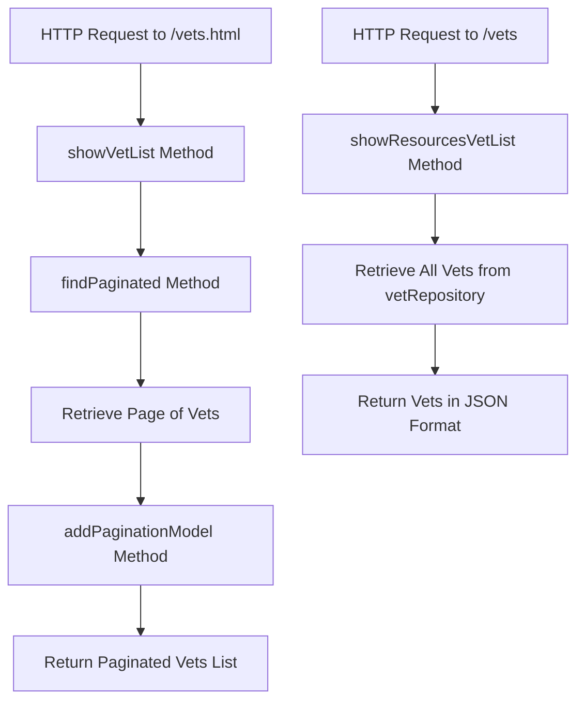

# Introduction to Vet Controller

The <SwmToken path="src/main/java/org/springframework/samples/petclinic/vet/VetController.java" pos="36:2:2" line-data="class VetController {">`VetController`</SwmToken> is responsible for handling HTTP requests related to veterinarians. It interacts with the <SwmToken path="src/main/java/org/springframework/samples/petclinic/vet/VetController.java" pos="66:3:3" line-data="		return vetRepository.findAll(pageable);">`vetRepository`</SwmToken> to retrieve and manage veterinarian data. The controller provides endpoints to display a list of veterinarians in both HTML and JSON formats.

## HTML Endpoint

The <SwmToken path="src/main/java/org/springframework/samples/petclinic/vet/VetController.java" pos="45:5:5" line-data="	public String showVetList(@RequestParam(defaultValue = &quot;1&quot;) int page, Model model) {">`showVetList`</SwmToken> method handles requests to <SwmToken path="src/main/java/org/springframework/samples/petclinic/vet/VetController.java" pos="44:5:8" line-data="	@GetMapping(&quot;/vets.html&quot;)">`/vets.html`</SwmToken> and returns a paginated list of veterinarians for display in the web interface. It uses the <SwmToken path="src/main/java/org/springframework/samples/petclinic/vet/VetController.java" pos="49:10:10" line-data="		Page&lt;Vet&gt; paginated = findPaginated(page);">`findPaginated`</SwmToken> method to retrieve a page of veterinarians and the <SwmToken path="src/main/java/org/springframework/samples/petclinic/vet/VetController.java" pos="51:3:3" line-data="		return addPaginationModel(page, paginated, model);">`addPaginationModel`</SwmToken> method to add pagination details to the model.

<SwmSnippet path="/src/main/java/org/springframework/samples/petclinic/vet/VetController.java" line="44">

---

The <SwmToken path="src/main/java/org/springframework/samples/petclinic/vet/VetController.java" pos="45:5:5" line-data="	public String showVetList(@RequestParam(defaultValue = &quot;1&quot;) int page, Model model) {">`showVetList`</SwmToken> method handles the HTML endpoint for displaying a paginated list of veterinarians.

```java
	@GetMapping("/vets.html")
	public String showVetList(@RequestParam(defaultValue = "1") int page, Model model) {
		// Here we are returning an object of type 'Vets' rather than a collection of Vet
		// objects so it is simpler for Object-Xml mapping
		Vets vets = new Vets();
		Page<Vet> paginated = findPaginated(page);
		vets.getVetList().addAll(paginated.toList());
		return addPaginationModel(page, paginated, model);
	}
```

---

</SwmSnippet>

## JSON Endpoint

The <SwmToken path="src/main/java/org/springframework/samples/petclinic/vet/VetController.java" pos="70:8:8" line-data="	public @ResponseBody Vets showResourcesVetList() {">`showResourcesVetList`</SwmToken> method handles requests to <SwmPath>[src/main/resources/templates/vets/](src/main/resources/templates/vets/)</SwmPath> and returns a list of veterinarians in JSON format for API consumers. It retrieves all veterinarians from the <SwmToken path="src/main/java/org/springframework/samples/petclinic/vet/VetController.java" pos="66:3:3" line-data="		return vetRepository.findAll(pageable);">`vetRepository`</SwmToken> and adds them to a <SwmToken path="src/main/java/org/springframework/samples/petclinic/vet/VetController.java" pos="44:6:6" line-data="	@GetMapping(&quot;/vets.html&quot;)">`vets`</SwmToken> object for JSON mapping.

<SwmSnippet path="/src/main/java/org/springframework/samples/petclinic/vet/VetController.java" line="69">

---

The <SwmToken path="src/main/java/org/springframework/samples/petclinic/vet/VetController.java" pos="70:8:8" line-data="	public @ResponseBody Vets showResourcesVetList() {">`showResourcesVetList`</SwmToken> method handles the JSON endpoint for returning a list of veterinarians.

```java
	@GetMapping({ "/vets" })
	public @ResponseBody Vets showResourcesVetList() {
		// Here we are returning an object of type 'Vets' rather than a collection of Vet
		// objects so it is simpler for JSon/Object mapping
		Vets vets = new Vets();
		vets.getVetList().addAll(this.vetRepository.findAll());
		return vets;
	}
```

---

</SwmSnippet>

## Pagination Management

Pagination is managed within the controller to ensure that the data is presented in manageable chunks. The <SwmToken path="src/main/java/org/springframework/samples/petclinic/vet/VetController.java" pos="49:10:10" line-data="		Page&lt;Vet&gt; paginated = findPaginated(page);">`findPaginated`</SwmToken> method is used to retrieve a specific page of veterinarians.

<SwmSnippet path="/src/main/java/org/springframework/samples/petclinic/vet/VetController.java" line="63">

---

The <SwmToken path="src/main/java/org/springframework/samples/petclinic/vet/VetController.java" pos="63:8:8" line-data="	private Page&lt;Vet&gt; findPaginated(int page) {">`findPaginated`</SwmToken> method retrieves a specific page of veterinarians from the repository.

```java
	private Page<Vet> findPaginated(int page) {
		int pageSize = 5;
		Pageable pageable = PageRequest.of(page - 1, pageSize);
		return vetRepository.findAll(pageable);
	}
```

---

</SwmSnippet>

## Data Passing to View Layer

The controller uses the <SwmToken path="src/main/java/org/springframework/samples/petclinic/vet/VetController.java" pos="45:24:24" line-data="	public String showVetList(@RequestParam(defaultValue = &quot;1&quot;) int page, Model model) {">`Model`</SwmToken> object to pass data to the view layer for rendering. The <SwmToken path="src/main/java/org/springframework/samples/petclinic/vet/VetController.java" pos="51:3:3" line-data="		return addPaginationModel(page, paginated, model);">`addPaginationModel`</SwmToken> method adds pagination details to the model.

<SwmSnippet path="/src/main/java/org/springframework/samples/petclinic/vet/VetController.java" line="54">

---

The <SwmToken path="src/main/java/org/springframework/samples/petclinic/vet/VetController.java" pos="54:5:5" line-data="	private String addPaginationModel(int page, Page&lt;Vet&gt; paginated, Model model) {">`addPaginationModel`</SwmToken> method adds pagination details to the model for rendering in the view layer.

```java
	private String addPaginationModel(int page, Page<Vet> paginated, Model model) {
		List<Vet> listVets = paginated.getContent();
		model.addAttribute("currentPage", page);
		model.addAttribute("totalPages", paginated.getTotalPages());
		model.addAttribute("totalItems", paginated.getTotalElements());
		model.addAttribute("listVets", listVets);
		return "vets/vetList";
	}
```

---

</SwmSnippet>

&nbsp;

*This is an auto-generated document by Swimm AI 🌊 and has not yet been verified by a human*

<SwmMeta version="3.0.0" repo-id="Z2l0aHViJTNBJTNBc3ByaW5nLXBldGNsaW5pYyUzQSUzQVN3aW1tLURlbW8=" repo-name="spring-petclinic"><sup>Powered by [Swimm](/)</sup></SwmMeta>
