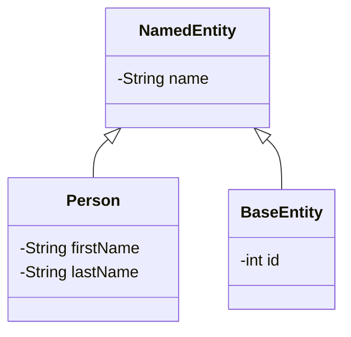

# Model Entities Overview

Model Entities represent the core data structures used to manage the application's domain. They encapsulate the properties and behaviors of the main objects within the pet clinic system. These entities include classes such as <SwmToken path="src/main/java/org/springframework/samples/petclinic/model/NamedEntity.java" pos="29:4:4" line-data="public class NamedEntity extends BaseEntity {">`NamedEntity`</SwmToken>, `Person`, and <SwmToken path="src/main/java/org/springframework/samples/petclinic/model/NamedEntity.java" pos="22:24:24" line-data=" * Simple JavaBean domain object adds a name property to &lt;code&gt;BaseEntity&lt;/code&gt;. Used as">`BaseEntity`</SwmToken>, which define the attributes and relationships of pets, owners, and visits.

Model Entities are used to map the application's data to the underlying database, ensuring that the data is stored and retrieved efficiently. They also provide a way to enforce business rules and validation logic, ensuring that the data remains consistent and accurate throughout the application's lifecycle.

<SwmSnippet path="/src/main/java/org/springframework/samples/petclinic/model/NamedEntity.java" line="1">

---

# <SwmToken path="src/main/java/org/springframework/samples/petclinic/model/NamedEntity.java" pos="29:4:4" line-data="public class NamedEntity extends BaseEntity {">`NamedEntity`</SwmToken>

The <SwmToken path="src/main/java/org/springframework/samples/petclinic/model/NamedEntity.java" pos="29:4:4" line-data="public class NamedEntity extends BaseEntity {">`NamedEntity`</SwmToken> class is used to represent entities that have a name attribute.

```java
/*
 * Copyright 2012-2019 the original author or authors.
 *
 * Licensed under the Apache License, Version 2.0 (the "License");
 * you may not use this file except in compliance with the License.
```

---

</SwmSnippet>

&nbsp;

*This is an auto-generated document by Swimm AI 🌊 and has not yet been verified by a human*

<SwmMeta version="3.0.0" repo-id="Z2l0aHViJTNBJTNBc3ByaW5nLXBldGNsaW5pYyUzQSUzQVN3aW1tLURlbW8=" repo-name="spring-petclinic"><sup>Powered by [Swimm](/)</sup></SwmMeta>
