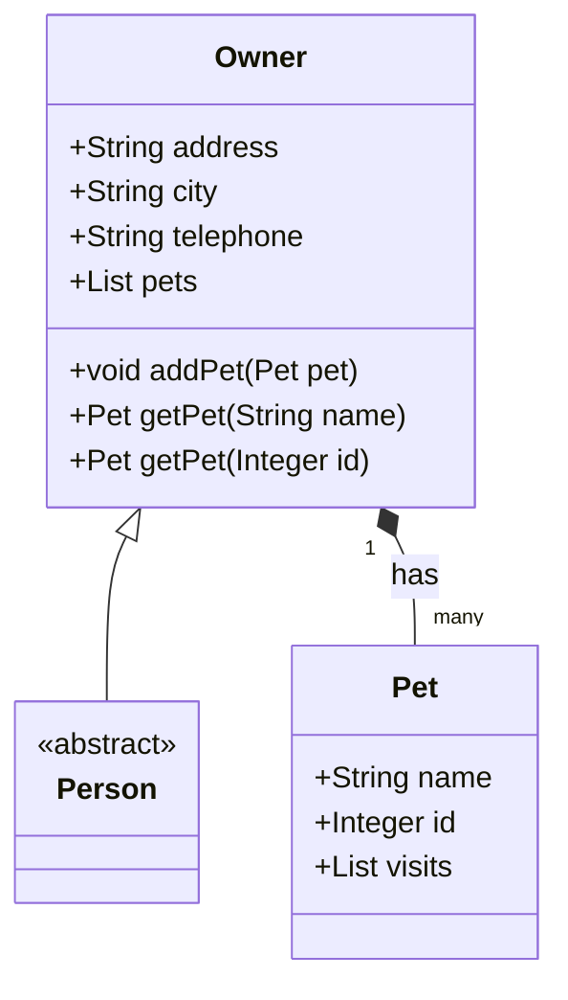

# Overview of Owner Management

The <SwmToken path="src/main/java/org/springframework/samples/petclinic/owner/Owner.java" pos="47:4:4" line-data="public class Owner extends Person {">`Owner`</SwmToken> class is a domain object representing a person who owns pets in the pet clinic system. It extends the <SwmToken path="src/main/java/org/springframework/samples/petclinic/owner/Owner.java" pos="47:8:8" line-data="public class Owner extends Person {">`Person`</SwmToken> class and includes additional attributes such as address, city, and telephone. The <SwmToken path="src/main/java/org/springframework/samples/petclinic/owner/Owner.java" pos="47:4:4" line-data="public class Owner extends Person {">`Owner`</SwmToken> class has a one-to-many relationship with the <SwmToken path="src/main/java/org/springframework/samples/petclinic/owner/Owner.java" pos="65:5:5" line-data="	private List&lt;Pet&gt; pets = new ArrayList&lt;&gt;();">`Pet`</SwmToken> class, meaning an owner can have multiple pets.

<SwmSnippet path="/src/main/java/org/springframework/samples/petclinic/owner/Owner.java" line="45">

---

## Owner Class Definition

The <SwmToken path="src/main/java/org/springframework/samples/petclinic/owner/Owner.java" pos="47:4:4" line-data="public class Owner extends Person {">`Owner`</SwmToken> class extends the <SwmToken path="src/main/java/org/springframework/samples/petclinic/owner/Owner.java" pos="47:8:8" line-data="public class Owner extends Person {">`Person`</SwmToken> class and includes additional attributes such as address, city, and telephone.

```java
@Entity
@Table(name = "owners")
public class Owner extends Person {
```

---

</SwmSnippet>

<SwmSnippet path="/src/main/java/org/springframework/samples/petclinic/owner/Owner.java" line="49">

---

## Owner Attributes

The <SwmToken path="src/main/java/org/springframework/samples/petclinic/owner/Owner.java" pos="47:4:4" line-data="public class Owner extends Person {">`Owner`</SwmToken> class has attributes for address, city, and telephone, with validation constraints to ensure data integrity.

```java
	@Column(name = "address")
	@NotBlank
	private String address;

	@Column(name = "city")
	@NotBlank
	private String city;

	@Column(name = "telephone")
	@NotBlank
	@Pattern(regexp = "\\d{10}", message = "Telephone must be a 10-digit number")
	private String telephone;
```

---

</SwmSnippet>

<SwmSnippet path="/src/main/java/org/springframework/samples/petclinic/owner/Owner.java" line="62">

---

## Relationship with Pets

The <SwmToken path="src/main/java/org/springframework/samples/petclinic/owner/Owner.java" pos="47:4:4" line-data="public class Owner extends Person {">`Owner`</SwmToken> class has a one-to-many relationship with the <SwmToken path="src/main/java/org/springframework/samples/petclinic/owner/Owner.java" pos="65:5:5" line-data="	private List&lt;Pet&gt; pets = new ArrayList&lt;&gt;();">`Pet`</SwmToken> class, meaning an owner can have multiple pets.

```java
	@OneToMany(cascade = CascadeType.ALL, fetch = FetchType.EAGER)
	@JoinColumn(name = "owner_id")
	@OrderBy("name")
	private List<Pet> pets = new ArrayList<>();
```

---

</SwmSnippet>

<SwmSnippet path="/src/main/java/org/springframework/samples/petclinic/owner/Owner.java" line="95">

---

## Methods in Owner Class

The <SwmToken path="src/main/java/org/springframework/samples/petclinic/owner/Owner.java" pos="102:32:32" line-data="	 * Return the Pet with the given name, or null if none found for this Owner.">`Owner`</SwmToken> class provides methods to add pets, retrieve pets by name or ID, and add visits to pets.

```java
	public void addPet(Pet pet) {
		if (pet.isNew()) {
			getPets().add(pet);
		}
	}

	/**
	 * Return the Pet with the given name, or null if none found for this Owner.
	 * @param name to test
	 * @return a pet if pet name is already in use
	 */
	public Pet getPet(String name) {
		return getPet(name, false);
	}

	/**
	 * Return the Pet with the given id, or null if none found for this Owner.
	 * @param id to test
	 * @return a pet if pet id is already in use
	 */
	public Pet getPet(Integer id) {
```

---

</SwmSnippet>

&nbsp;

*This is an auto-generated document by Swimm AI 🌊 and has not yet been verified by a human*

<SwmMeta version="3.0.0" repo-id="Z2l0aHViJTNBJTNBc3ByaW5nLXBldGNsaW5pYyUzQSUzQVN3aW1tLURlbW8=" repo-name="spring-petclinic"><sup>Powered by [Swimm](/)</sup></SwmMeta>
