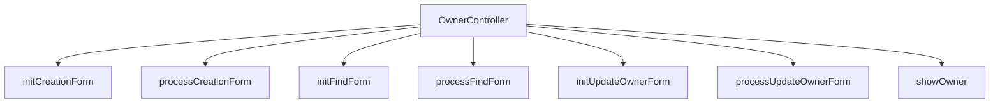

# Overview

The <SwmToken path="src/main/java/org/springframework/samples/petclinic/owner/OwnerController.java" pos="46:2:2" line-data="class OwnerController {">`OwnerController`</SwmToken> is responsible for handling web requests related to owner management in the Spring <SwmToken path="src/main/java/org/springframework/samples/petclinic/owner/OwnerController.java" pos="16:8:8" line-data="package org.springframework.samples.petclinic.owner;">`petclinic`</SwmToken> application. It provides methods to create, update, find, and display owner information.

# Creating a New Owner

The <SwmToken path="src/main/java/org/springframework/samples/petclinic/owner/OwnerController.java" pos="67:5:5" line-data="	public String initCreationForm(Map&lt;String, Object&gt; model) {">`initCreationForm`</SwmToken> method initializes the form for creating a new owner. It sets up a new Owner object and returns the view for the creation form.

The <SwmToken path="src/main/java/org/springframework/samples/petclinic/owner/OwnerController.java" pos="74:5:5" line-data="	public String processCreationForm(@Valid Owner owner, BindingResult result, RedirectAttributes redirectAttributes) {">`processCreationForm`</SwmToken> method processes the form submission for creating a new owner. It validates the input and saves the owner to the repository if there are no errors.

<SwmSnippet path="/src/main/java/org/springframework/samples/petclinic/owner/OwnerController.java" line="73">

---

The <SwmToken path="src/main/java/org/springframework/samples/petclinic/owner/OwnerController.java" pos="74:5:5" line-data="	public String processCreationForm(@Valid Owner owner, BindingResult result, RedirectAttributes redirectAttributes) {">`processCreationForm`</SwmToken> method processes the form submission for creating a new owner, validating the owner object and saving it to the repository if there are no errors.

```java
	@PostMapping("/owners/new")
	public String processCreationForm(@Valid Owner owner, BindingResult result, RedirectAttributes redirectAttributes) {
		if (result.hasErrors()) {
			redirectAttributes.addFlashAttribute("error", "There was an error in creating the owner.");
			return VIEWS_OWNER_CREATE_OR_UPDATE_FORM;
		}

		this.owners.save(owner);
		redirectAttributes.addFlashAttribute("message", "New Owner Created");
		return "redirect:/owners/" + owner.getId();
	}
```

---

</SwmSnippet>

<SwmSnippet path="/src/main/java/org/springframework/samples/petclinic/owner/OwnerController.java" line="85">

---

The <SwmToken path="src/main/java/org/springframework/samples/petclinic/owner/OwnerController.java" pos="86:5:5" line-data="	public String initFindForm() {">`initFindForm`</SwmToken> method initializes the form for finding owners by returning the view name for the find owners form.

```java
	@GetMapping("/owners/find")
	public String initFindForm() {
		return "owners/findOwners";
	}
```

---

</SwmSnippet>

The <SwmToken path="src/main/java/org/springframework/samples/petclinic/owner/OwnerController.java" pos="91:5:5" line-data="	public String processFindForm(@RequestParam(defaultValue = &quot;1&quot;) int page, Owner owner, BindingResult result,">`processFindForm`</SwmToken> method processes the form submission for finding owners. It supports pagination and searches by last name, returning the appropriate view based on the search results.

# Updating an Owner

The <SwmToken path="src/main/java/org/springframework/samples/petclinic/owner/OwnerController.java" pos="132:5:5" line-data="	public String initUpdateOwnerForm(@PathVariable(&quot;ownerId&quot;) int ownerId, Model model) {">`initUpdateOwnerForm`</SwmToken> method initializes the form for updating an existing owner. It retrieves the owner by ID and returns the view for the update form.

<SwmSnippet path="/src/main/java/org/springframework/samples/petclinic/owner/OwnerController.java" line="131">

---

The <SwmToken path="src/main/java/org/springframework/samples/petclinic/owner/OwnerController.java" pos="132:5:5" line-data="	public String initUpdateOwnerForm(@PathVariable(&quot;ownerId&quot;) int ownerId, Model model) {">`initUpdateOwnerForm`</SwmToken> method initializes the form for updating an existing owner by retrieving the owner by ID and adding it to the model.

```java
	@GetMapping("/owners/{ownerId}/edit")
	public String initUpdateOwnerForm(@PathVariable("ownerId") int ownerId, Model model) {
		Owner owner = this.owners.findById(ownerId);
		model.addAttribute(owner);
		return VIEWS_OWNER_CREATE_OR_UPDATE_FORM;
	}
```

---

</SwmSnippet>

<SwmSnippet path="/src/main/java/org/springframework/samples/petclinic/owner/OwnerController.java" line="138">

---

The <SwmToken path="src/main/java/org/springframework/samples/petclinic/owner/OwnerController.java" pos="139:5:5" line-data="	public String processUpdateOwnerForm(@Valid Owner owner, BindingResult result, @PathVariable(&quot;ownerId&quot;) int ownerId,">`processUpdateOwnerForm`</SwmToken> method processes the form submission for updating an existing owner, validating the owner object and saving the updated owner to the repository if there are no errors.

```java
	@PostMapping("/owners/{ownerId}/edit")
	public String processUpdateOwnerForm(@Valid Owner owner, BindingResult result, @PathVariable("ownerId") int ownerId,
			RedirectAttributes redirectAttributes) {
		if (result.hasErrors()) {
			redirectAttributes.addFlashAttribute("error", "There was an error in updating the owner.");
			return VIEWS_OWNER_CREATE_OR_UPDATE_FORM;
		}

		owner.setId(ownerId);
		this.owners.save(owner);
		redirectAttributes.addFlashAttribute("message", "Owner Values Updated");
		return "redirect:/owners/{ownerId}";
	}
```

---

</SwmSnippet>

# Displaying Owner Details

The <SwmToken path="src/main/java/org/springframework/samples/petclinic/owner/OwnerController.java" pos="158:5:5" line-data="	public ModelAndView showOwner(@PathVariable(&quot;ownerId&quot;) int ownerId) {">`showOwner`</SwmToken> method displays the details of a specific owner. It retrieves the owner by ID and returns the view for displaying owner details.

&nbsp;

*This is an auto-generated document by Swimm AI 🌊 and has not yet been verified by a human*

<SwmMeta version="3.0.0" repo-id="Z2l0aHViJTNBJTNBc3ByaW5nLXBldGNsaW5pYyUzQSUzQVN3aW1tLURlbW8=" repo-name="spring-petclinic"><sup>Powered by [Swimm](/)</sup></SwmMeta>
