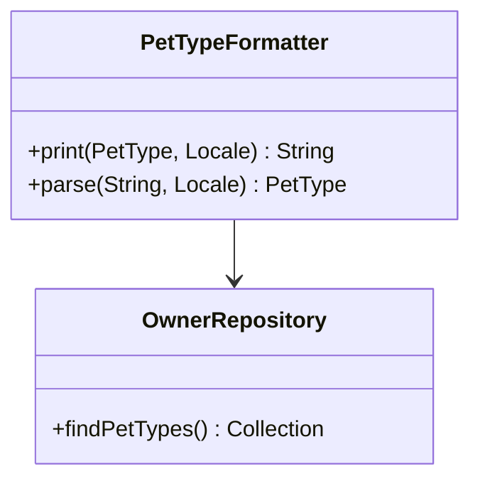

# Overview

The <SwmToken path="src/main/java/org/springframework/samples/petclinic/owner/PetTypeFormatter.java" pos="37:4:4" line-data="public class PetTypeFormatter implements Formatter&lt;PetType&gt; {">`PetTypeFormatter`</SwmToken> is a component in the Spring <SwmToken path="src/main/java/org/springframework/samples/petclinic/owner/PetTypeFormatter.java" pos="16:8:8" line-data="package org.springframework.samples.petclinic.owner;">`petclinic`</SwmToken> application that instructs Spring MVC on how to parse and print elements of type <SwmToken path="src/main/java/org/springframework/samples/petclinic/owner/PetTypeFormatter.java" pos="37:10:10" line-data="public class PetTypeFormatter implements Formatter&lt;PetType&gt; {">`PetType`</SwmToken>. It uses the <SwmToken path="src/main/java/org/springframework/samples/petclinic/owner/PetTypeFormatter.java" pos="39:5:5" line-data="	private final OwnerRepository owners;">`OwnerRepository`</SwmToken> to fetch the available pet types from the database.

# <SwmToken path="src/main/java/org/springframework/samples/petclinic/owner/PetTypeFormatter.java" pos="37:4:4" line-data="public class PetTypeFormatter implements Formatter&lt;PetType&gt; {">`PetTypeFormatter`</SwmToken> Class

The <SwmToken path="src/main/java/org/springframework/samples/petclinic/owner/PetTypeFormatter.java" pos="37:4:4" line-data="public class PetTypeFormatter implements Formatter&lt;PetType&gt; {">`PetTypeFormatter`</SwmToken> class implements the <SwmToken path="src/main/java/org/springframework/samples/petclinic/owner/PetTypeFormatter.java" pos="37:8:8" line-data="public class PetTypeFormatter implements Formatter&lt;PetType&gt; {">`Formatter`</SwmToken> interface for <SwmToken path="src/main/java/org/springframework/samples/petclinic/owner/PetTypeFormatter.java" pos="37:10:10" line-data="public class PetTypeFormatter implements Formatter&lt;PetType&gt; {">`PetType`</SwmToken> objects. It provides methods to print and parse <SwmToken path="src/main/java/org/springframework/samples/petclinic/owner/PetTypeFormatter.java" pos="37:10:10" line-data="public class PetTypeFormatter implements Formatter&lt;PetType&gt; {">`PetType`</SwmToken> objects.

<SwmSnippet path="/src/main/java/org/springframework/samples/petclinic/owner/PetTypeFormatter.java" line="36">

---

The <SwmToken path="src/main/java/org/springframework/samples/petclinic/owner/PetTypeFormatter.java" pos="37:4:4" line-data="public class PetTypeFormatter implements Formatter&lt;PetType&gt; {">`PetTypeFormatter`</SwmToken> class is annotated with <SwmToken path="src/main/java/org/springframework/samples/petclinic/owner/PetTypeFormatter.java" pos="36:0:1" line-data="@Component">`@Component`</SwmToken>, indicating that it is a Spring-managed bean. The constructor is annotated with <SwmToken path="src/main/java/org/springframework/samples/petclinic/owner/PetTypeFormatter.java" pos="41:1:2" line-data="	@Autowired">`@Autowired`</SwmToken>, which means the <SwmToken path="src/main/java/org/springframework/samples/petclinic/owner/PetTypeFormatter.java" pos="39:5:5" line-data="	private final OwnerRepository owners;">`OwnerRepository`</SwmToken> dependency is injected by Spring.

```java
@Component
public class PetTypeFormatter implements Formatter<PetType> {

	private final OwnerRepository owners;

	@Autowired
	public PetTypeFormatter(OwnerRepository owners) {
		this.owners = owners;
	}
```

---

</SwmSnippet>

# print Method

The <SwmToken path="src/main/java/org/springframework/samples/petclinic/owner/PetTypeFormatter.java" pos="47:5:5" line-data="	public String print(PetType petType, Locale locale) {">`print`</SwmToken> method converts a <SwmToken path="src/main/java/org/springframework/samples/petclinic/owner/PetTypeFormatter.java" pos="37:10:10" line-data="public class PetTypeFormatter implements Formatter&lt;PetType&gt; {">`PetType`</SwmToken> object into its name as a string. This is useful for displaying the pet type in a user-friendly format.

<SwmSnippet path="/src/main/java/org/springframework/samples/petclinic/owner/PetTypeFormatter.java" line="46">

---

The <SwmToken path="src/main/java/org/springframework/samples/petclinic/owner/PetTypeFormatter.java" pos="47:5:5" line-data="	public String print(PetType petType, Locale locale) {">`print`</SwmToken> method implementation in the <SwmToken path="src/main/java/org/springframework/samples/petclinic/owner/PetTypeFormatter.java" pos="37:4:4" line-data="public class PetTypeFormatter implements Formatter&lt;PetType&gt; {">`PetTypeFormatter`</SwmToken> class.

```java
	@Override
	public String print(PetType petType, Locale locale) {
		return petType.getName();
	}
```

---

</SwmSnippet>

# parse Method

The <SwmToken path="src/main/java/org/springframework/samples/petclinic/owner/PetTypeFormatter.java" pos="52:5:5" line-data="	public PetType parse(String text, Locale locale) throws ParseException {">`parse`</SwmToken> method converts a string into a <SwmToken path="src/main/java/org/springframework/samples/petclinic/owner/PetTypeFormatter.java" pos="37:10:10" line-data="public class PetTypeFormatter implements Formatter&lt;PetType&gt; {">`PetType`</SwmToken> object by matching the string with the names of available pet types fetched from the <SwmToken path="src/main/java/org/springframework/samples/petclinic/owner/PetTypeFormatter.java" pos="39:5:5" line-data="	private final OwnerRepository owners;">`OwnerRepository`</SwmToken>. If no match is found, a <SwmToken path="src/main/java/org/springframework/samples/petclinic/owner/PetTypeFormatter.java" pos="52:19:19" line-data="	public PetType parse(String text, Locale locale) throws ParseException {">`ParseException`</SwmToken> is thrown.

<SwmSnippet path="/src/main/java/org/springframework/samples/petclinic/owner/PetTypeFormatter.java" line="51">

---

The <SwmToken path="src/main/java/org/springframework/samples/petclinic/owner/PetTypeFormatter.java" pos="52:5:5" line-data="	public PetType parse(String text, Locale locale) throws ParseException {">`parse`</SwmToken> method implementation in the <SwmToken path="src/main/java/org/springframework/samples/petclinic/owner/PetTypeFormatter.java" pos="37:4:4" line-data="public class PetTypeFormatter implements Formatter&lt;PetType&gt; {">`PetTypeFormatter`</SwmToken> class.

```java
	@Override
	public PetType parse(String text, Locale locale) throws ParseException {
		Collection<PetType> findPetTypes = this.owners.findPetTypes();
		for (PetType type : findPetTypes) {
			if (type.getName().equals(text)) {
				return type;
			}
		}
		throw new ParseException("type not found: " + text, 0);
	}
```

---

</SwmSnippet>

&nbsp;

*This is an auto-generated document by Swimm AI 🌊 and has not yet been verified by a human*

<SwmMeta version="3.0.0" repo-id="Z2l0aHViJTNBJTNBc3ByaW5nLXBldGNsaW5pYyUzQSUzQVN3aW1tLURlbW8=" repo-name="spring-petclinic"><sup>Powered by [Swimm](/)</sup></SwmMeta>
