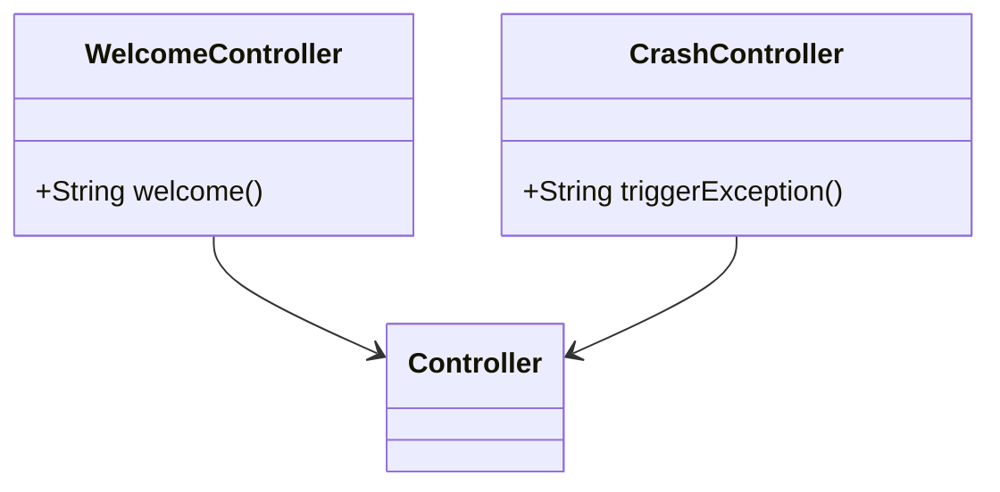

# Overview

System Controllers are responsible for handling HTTP requests and mapping them to appropriate handler methods. These controllers are annotated with <SwmToken path="src/main/java/org/springframework/samples/petclinic/system/CrashController.java" pos="28:0:1" line-data="@Controller">`@Controller`</SwmToken> to indicate that they are Spring MVC controllers. The <SwmToken path="src/main/java/org/springframework/samples/petclinic/system/CrashController.java" pos="31:1:2" line-data="	@GetMapping(&quot;/oups&quot;)">`@GetMapping`</SwmToken> annotation is used to map HTTP GET requests to specific handler methods within these controllers.

# WelcomeController

The `WelcomeController` class handles requests to the root URL and returns the 'welcome' view. It is annotated with <SwmToken path="src/main/java/org/springframework/samples/petclinic/system/CrashController.java" pos="28:0:1" line-data="@Controller">`@Controller`</SwmToken> to indicate that it is a Spring MVC controller, and uses <SwmToken path="src/main/java/org/springframework/samples/petclinic/system/CrashController.java" pos="31:1:2" line-data="	@GetMapping(&quot;/oups&quot;)">`@GetMapping`</SwmToken> to map HTTP GET requests to the `welcome` method.

# <SwmToken path="src/main/java/org/springframework/samples/petclinic/system/CrashController.java" pos="29:2:2" line-data="class CrashController {">`CrashController`</SwmToken>

The <SwmToken path="src/main/java/org/springframework/samples/petclinic/system/CrashController.java" pos="29:2:2" line-data="class CrashController {">`CrashController`</SwmToken> class is used to demonstrate error handling by intentionally throwing an exception when the '/oups' URL is accessed. This helps in understanding how the application handles unexpected errors and displays error pages.

<SwmSnippet path="/src/main/java/org/springframework/samples/petclinic/system/CrashController.java" line="31">

---

The <SwmToken path="src/main/java/org/springframework/samples/petclinic/system/CrashController.java" pos="31:5:6" line-data="	@GetMapping(&quot;/oups&quot;)">`/oups`</SwmToken> endpoint in the <SwmToken path="src/main/java/org/springframework/samples/petclinic/system/CrashController.java" pos="29:2:2" line-data="class CrashController {">`CrashController`</SwmToken> class is used to demonstrate error handling by intentionally throwing a <SwmToken path="src/main/java/org/springframework/samples/petclinic/system/CrashController.java" pos="33:5:5" line-data="		throw new RuntimeException(">`RuntimeException`</SwmToken>. When this endpoint is accessed, it triggers an exception to showcase the application's error handling mechanism.

```java
	@GetMapping("/oups")
	public String triggerException() {
		throw new RuntimeException(
				"Expected: controller used to showcase what " + "happens when an exception is thrown");
	}
```

---

</SwmSnippet>

&nbsp;

*This is an auto-generated document by Swimm AI 🌊 and has not yet been verified by a human*

<SwmMeta version="3.0.0" repo-id="Z2l0aHViJTNBJTNBc3ByaW5nLXBldGNsaW5pYyUzQSUzQVN3aW1tLURlbW8=" repo-name="spring-petclinic"><sup>Powered by [Swimm](/)</sup></SwmMeta>
