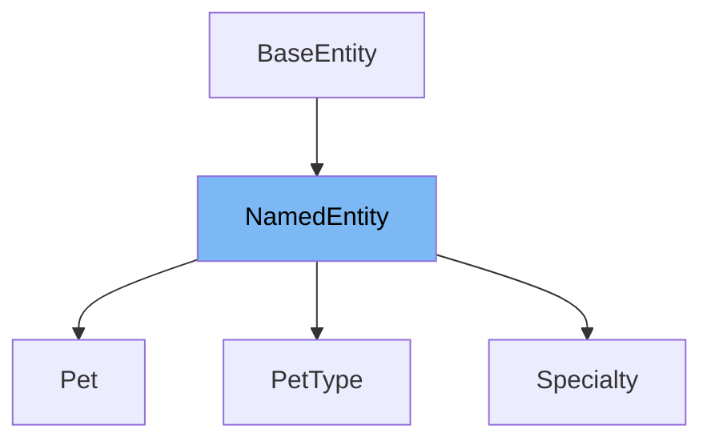

This document will cover the class <SwmToken path="src/main/java/org/springframework/samples/petclinic/owner/PetType.java" pos="28:8:8" line-data="public class PetType extends NamedEntity {">`NamedEntity`</SwmToken> in detail. We will cover:

1. What <SwmToken path="src/main/java/org/springframework/samples/petclinic/owner/PetType.java" pos="28:8:8" line-data="public class PetType extends NamedEntity {">`NamedEntity`</SwmToken> is.
2. Variables and functions in <SwmToken path="src/main/java/org/springframework/samples/petclinic/owner/PetType.java" pos="28:8:8" line-data="public class PetType extends NamedEntity {">`NamedEntity`</SwmToken>.
3. Usage example of <SwmToken path="src/main/java/org/springframework/samples/petclinic/owner/PetType.java" pos="28:8:8" line-data="public class PetType extends NamedEntity {">`NamedEntity`</SwmToken> in <SwmToken path="src/main/java/org/springframework/samples/petclinic/owner/PetType.java" pos="28:4:4" line-data="public class PetType extends NamedEntity {">`PetType`</SwmToken>.



# What is <SwmToken path="src/main/java/org/springframework/samples/petclinic/owner/PetType.java" pos="28:8:8" line-data="public class PetType extends NamedEntity {">`NamedEntity`</SwmToken>

<SwmToken path="src/main/java/org/springframework/samples/petclinic/owner/PetType.java" pos="28:8:8" line-data="public class PetType extends NamedEntity {">`NamedEntity`</SwmToken> is a simple <SwmToken path="src/main/java/org/springframework/samples/petclinic/model/NamedEntity.java" pos="22:5:5" line-data=" * Simple JavaBean domain object adds a name property to &lt;code&gt;BaseEntity&lt;/code&gt;. Used as">`JavaBean`</SwmToken> domain object that adds a name property to the <SwmToken path="src/main/java/org/springframework/samples/petclinic/model/NamedEntity.java" pos="22:24:24" line-data=" * Simple JavaBean domain object adds a name property to &lt;code&gt;BaseEntity&lt;/code&gt;. Used as">`BaseEntity`</SwmToken> class. It is used as a base class for objects that need a name property. This class is annotated with <SwmToken path="src/main/java/org/springframework/samples/petclinic/model/NamedEntity.java" pos="28:0:1" line-data="@MappedSuperclass">`@MappedSuperclass`</SwmToken>, indicating that it is a JPA entity superclass.

<SwmSnippet path="/src/main/java/org/springframework/samples/petclinic/model/NamedEntity.java" line="31">

---

# Variables and functions

The variable <SwmToken path="src/main/java/org/springframework/samples/petclinic/model/NamedEntity.java" pos="31:4:4" line-data="	@Column(name = &quot;name&quot;)">`name`</SwmToken> is used to store the name of the entity. It is annotated with <SwmToken path="src/main/java/org/springframework/samples/petclinic/model/NamedEntity.java" pos="31:1:11" line-data="	@Column(name = &quot;name&quot;)">`@Column(name = "name")`</SwmToken> to map it to the 'name' column in the database.

```java
	@Column(name = "name")
	private String name;
```

---

</SwmSnippet>

<SwmSnippet path="/src/main/java/org/springframework/samples/petclinic/model/NamedEntity.java" line="34">

---

The function <SwmToken path="src/main/java/org/springframework/samples/petclinic/model/NamedEntity.java" pos="34:5:5" line-data="	public String getName() {">`getName`</SwmToken> is a getter method that returns the value of the <SwmToken path="src/main/java/org/springframework/samples/petclinic/model/NamedEntity.java" pos="35:5:5" line-data="		return this.name;">`name`</SwmToken> variable.

```java
	public String getName() {
		return this.name;
	}
```

---

</SwmSnippet>

<SwmSnippet path="/src/main/java/org/springframework/samples/petclinic/model/NamedEntity.java" line="38">

---

The function <SwmToken path="src/main/java/org/springframework/samples/petclinic/model/NamedEntity.java" pos="38:5:5" line-data="	public void setName(String name) {">`setName`</SwmToken> is a setter method that sets the value of the <SwmToken path="src/main/java/org/springframework/samples/petclinic/model/NamedEntity.java" pos="38:9:9" line-data="	public void setName(String name) {">`name`</SwmToken> variable.

```java
	public void setName(String name) {
		this.name = name;
	}
```

---

</SwmSnippet>

<SwmSnippet path="/src/main/java/org/springframework/samples/petclinic/model/NamedEntity.java" line="42">

---

The function <SwmToken path="src/main/java/org/springframework/samples/petclinic/model/NamedEntity.java" pos="43:5:5" line-data="	public String toString() {">`toString`</SwmToken> overrides the default <SwmToken path="src/main/java/org/springframework/samples/petclinic/model/NamedEntity.java" pos="43:5:5" line-data="	public String toString() {">`toString`</SwmToken> method to return the value of the <SwmToken path="src/main/java/org/springframework/samples/petclinic/model/NamedEntity.java" pos="31:4:4" line-data="	@Column(name = &quot;name&quot;)">`name`</SwmToken> variable.

```java
	@Override
	public String toString() {
		return this.getName();
	}
```

---

</SwmSnippet>

# Usage example

Here is an example of how to use <SwmToken path="src/main/java/org/springframework/samples/petclinic/owner/PetType.java" pos="28:8:8" line-data="public class PetType extends NamedEntity {">`NamedEntity`</SwmToken> in the <SwmToken path="src/main/java/org/springframework/samples/petclinic/owner/PetType.java" pos="28:4:4" line-data="public class PetType extends NamedEntity {">`PetType`</SwmToken> class. The <SwmToken path="src/main/java/org/springframework/samples/petclinic/owner/PetType.java" pos="28:4:4" line-data="public class PetType extends NamedEntity {">`PetType`</SwmToken> class extends <SwmToken path="src/main/java/org/springframework/samples/petclinic/owner/PetType.java" pos="28:8:8" line-data="public class PetType extends NamedEntity {">`NamedEntity`</SwmToken>, inheriting its properties and methods.

<SwmSnippet path="/src/main/java/org/springframework/samples/petclinic/owner/PetType.java" line="27">

---

The <SwmToken path="src/main/java/org/springframework/samples/petclinic/owner/PetType.java" pos="28:4:4" line-data="public class PetType extends NamedEntity {">`PetType`</SwmToken> class extends <SwmToken path="src/main/java/org/springframework/samples/petclinic/owner/PetType.java" pos="28:8:8" line-data="public class PetType extends NamedEntity {">`NamedEntity`</SwmToken>, which means it inherits the <SwmToken path="src/main/java/org/springframework/samples/petclinic/owner/PetType.java" pos="27:3:3" line-data="@Table(name = &quot;types&quot;)">`name`</SwmToken> property and its getter and setter methods.

```java
@Table(name = "types")
public class PetType extends NamedEntity {
```

---

</SwmSnippet>

&nbsp;

*This is an auto-generated document by Swimm AI 🌊 and has not yet been verified by a human*

<SwmMeta version="3.0.0" repo-id="Z2l0aHViJTNBJTNBc3ByaW5nLXBldGNsaW5pYyUzQSUzQVN3aW1tLURlbW8=" repo-name="spring-petclinic"><sup>Powered by [Swimm](/)</sup></SwmMeta>
